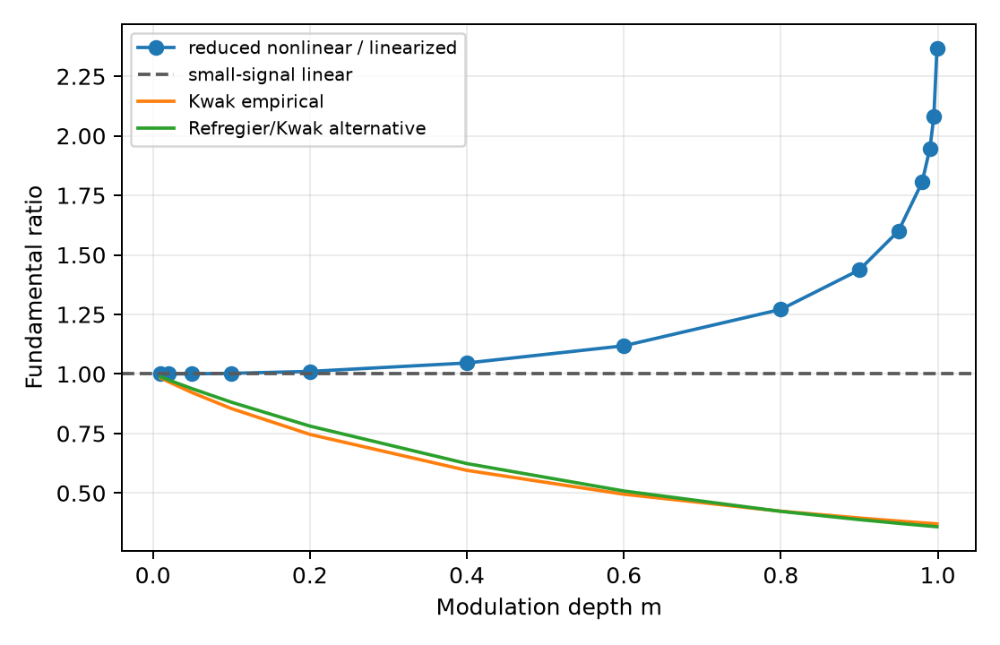
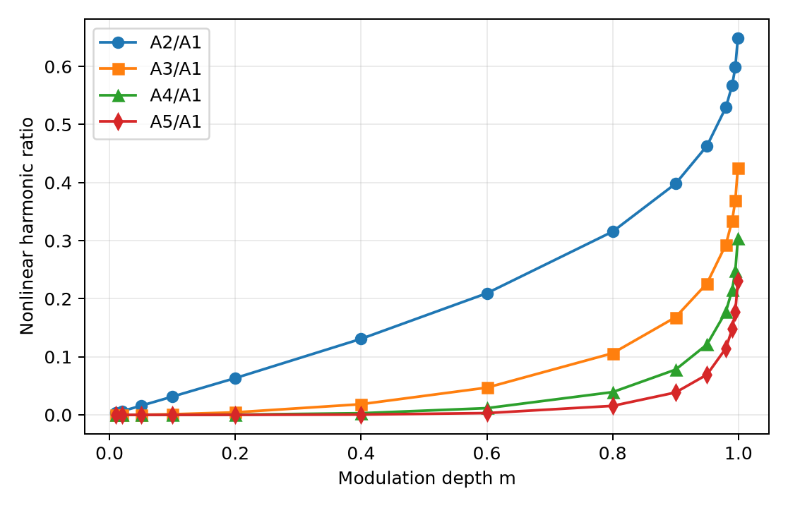
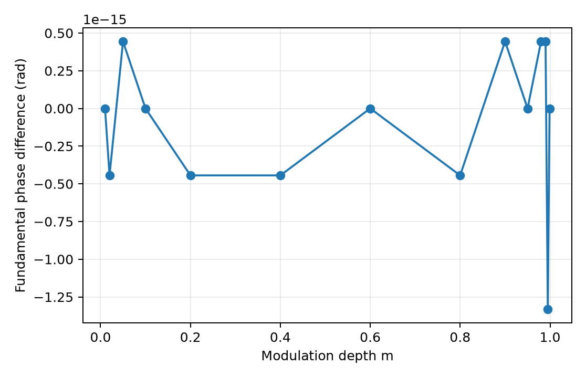
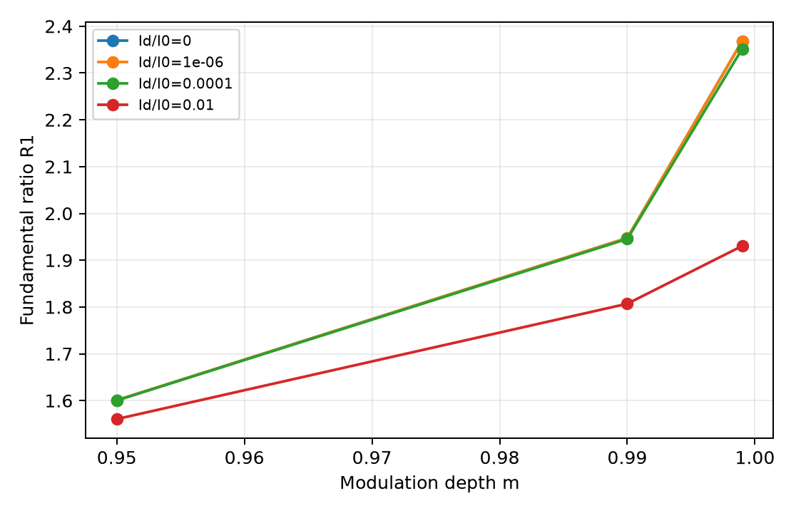
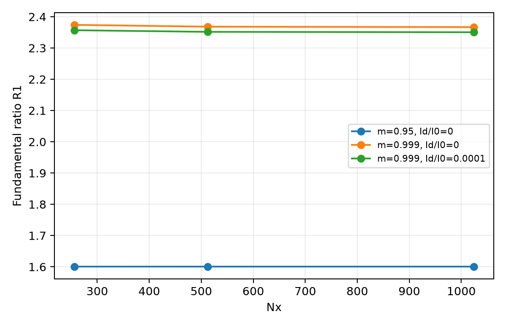

# Kwak-parameter reduced PR material harmonics

## Scope and result

This material-only calculation evaluates LCProp's existing reduced x-only
nonlinear hopping equation and its committed linearization at the grating
parameters reported by Kwak et al., *Optics Communications* **105** (1994)
353--358. It does not reconstruct every property of the experimental crystal
and does not fit the model to the empirical curves.

The result is opposite to the empirical suppression law: the reduced model's
Bragg-matched fundamental remains superlinear and strengthens rapidly near a
dark fringe. At the primary `Nx=512`, `Id/I0=0` setting, `R1=A1_NL/A1_lin` is
`1.600718578278` at `m=0.95`, `1.947412153459` at `m=0.99`, and
`2.368239457375` at `m=0.999`. No sampled primary row has `R1<1`, and the
fundamental phase is unchanged to numerical precision.

## Parameter mapping

| Kwak quantity | LCProp field or combination | Action |
| --- | --- | --- |
| `lambda=514.5 nm` | no material-ratio input | retained as experimental context only |
| `Lambda=2.2 um` | periodic domain length | set exactly; `kg=2*pi/Lambda=2.855993321445266 rad/um` (the prompt's rounded value is `2.855993321`) |
| `epsilon_r=513` | `PRMaterialSpec.relative_permittivity` | set directly |
| `N=2e22 m^-3` | `PRMaterialSpec.mobile_charge_density_m3` | set directly |
| `E_app=0` | solver and linearized-spec applied field | set directly |
| `I0=1` | optical mean and linearization normalization | set directly |
| `Id/I0` | uniform addition to driving intensity and explicit `background_intensity` | primary zero; sensitivity sweep as prescribed |
| room temperature | `PRMaterialSpec.temperature_K` | retained repository convention `293 K`; not fixed by the supplied Kwak values |

These values give `kD=5.285348354275176 /um` and `kg/kD=0.5403604701164361`.
The repository constants and retained temperature imply a diffusion-field
scale `(k_B T/e) kD=1334.633457899 V/cm`. The computed small-signal normalized
amplitude is `A1_lin/m=0.418229765773`, or `558.183438490 V/cm`, 2.07% below
Kwak's quoted approximately `570 V/cm`. This comparison is compatible with
the repository normalization, but it is not a fitted material reconstruction.
Extraordinary polarization and electro-optic coefficients do not enter the
reported material-field ratios.

The driving intensity follows production's convention:

```text
I_total(x) = I0 [1 + m sin(kg x)] + Id,
background_intensity = Id.
```

The equation is homogeneous when `I0`, `Id`, and the linearization reference
are scaled together, so global optical intensity normalization cancels from
the field and harmonic ratios. A focused executable test verifies this.

## Numerical convention

The endpoint-excluded grid covers exactly one period, so `K` through `5K` are
FFT bins 1 through 5 without interpolation or windowing. For a real field,

```text
c_n = (1/Nx) sum_j [E_j - mean(E)] exp(-i 2*pi*n*j/Nx),
A_n = 2 |c_n|.
```

The harness calls committed `PRMaterialSpec.characteristic_wavenumber_per_um`,
`solve_pr_static_intensity_batched` (whose residual is `hopping_rhs`), and
`solve_pr_reduced_linearized_intensity`. It retains the earlier study's
centered-difference discretization and Newton tolerances (`1e-12` RMS,
`1e-11` maximum). No optical propagation or self-consistency is present.

## Primary sweep and empirical comparison

The exact modulation sequence is `0.01`, `0.02`, `0.05`, `0.10`, `0.20`,
`0.40`, `0.60`, `0.80`, `0.90`, `0.95`, `0.98`, `0.99`, `0.995`, `0.999`.
`R1` increases monotonically from `1.000026312436` to `2.368239457375`.
At the three high-modulation points:

| `m` | reduced `R1` | Kwak `1/(1+1.70m)` | exponential alternative |
| ---: | ---: | ---: | ---: |
| 0.950 | 1.600719 | 0.382409 | 0.372824 |
| 0.990 | 1.947412 | 0.372717 | 0.361070 |
| 0.999 | 2.368239 | 0.370604 | 0.358510 |



This disagreement is a result of evaluating the existing reduced model, not
evidence that the empirical analysis is wrong. Material constants or physics
not fixed or represented by this mapping may control the experimental
large-modulation suppression.

## Harmonics and phase

At `m=0.95`, the nonlinear ratios are `A2/A1=0.463359819`,
`A3/A1=0.226467579`, `A4/A1=0.121299500`, and `A5/A1=0.069337995`.
At `m=0.999`, they grow to `0.649200559`, `0.425820818`, `0.303371825`, and
`0.230252164`. The maximum absolute fundamental phase difference over the
primary sweep is `1.3323e-15 rad`, so there is no meaningful phase shift.





For `m<=0.1`, a through-origin fit gives
`R1-1 = 0.2644347980 m^2`. Log-log exponents are `2.002116743` for
`R1-1`, `2.002098380` for `A2`, and `3.003114929` for `A3`. The committed
model therefore recovers its expected small-modulation limits.

## Dark-background sensitivity

Adding dark illumination weakens but does not reverse the enhancement in the
prescribed sensitivity range. At `m=0.999`, `R1` is `2.368239457` for zero
dark background, `2.368065961` for `Id/I0=1e-6`, `2.351688368` for `1e-4`,
and `1.930383541` for `1e-2`. All twelve sensitivity rows remain superlinear.



## Resolution qualification

| case | `R1(256)` | `R1(512)` | `R1(1024)` | coarse/fine change ratio |
| --- | ---: | ---: | ---: | ---: |
| `m=0.95`, `Id/I0=0` | 1.600744406 | 1.600718578 | 1.600712119 | 3.998 |
| `m=0.999`, `Id/I0=0` | 2.374086419 | 2.368239457 | 2.366812415 | 4.097 |
| `m=0.999`, `Id/I0=1e-4` | 2.356895093 | 2.351688368 | 2.350414847 | 4.088 |

The approximately factor-of-four decrease is consistent with the existing
second-order centered-difference discretization. The `512` to `1024` relative
change is `4.04e-6` at `m=0.95` and at most `6.03e-4` for the near-dark-node
cases. The largest accepted residual maximum is `1.65e-12`, below the fixed
`1e-11` requirement.



## Provenance and limitations

The normal repository was on `feature/pr-second-order-static` at
`d21a95e816d6750bab2e7b5e9f18cfc1ece6e5cf` and remained untouched. It was
dirty and was recorded for context only. Authoritative imports came from the
separate detached clean checkout
`/private/tmp/lcprop-kwak-02-34-d21a95e` at the same immutable SHA; its
porcelain status was empty before and after execution.

The external finalized harness, its exact checksum, environment versions,
canonical scientific-data checksum, normal-tree status, and checksums for all
CSV/JSON/PNG evidence and this report are recorded in `results/manifest.json`.
An initial Python 3.9 import failure occurred before solver execution. A first
completed output that had not added `Id` to the driving intensity was explicitly
superseded after production source-convention review; only the corrected run is
authoritative.

This is the existing zero-bias reduced PR model evaluated at the subset of
Kwak parameters that maps directly onto it. The result does not establish a
universal superlinear law, does not reproduce all experimental material
physics, and contains no optical coupling, fanning, or propagation claim.
