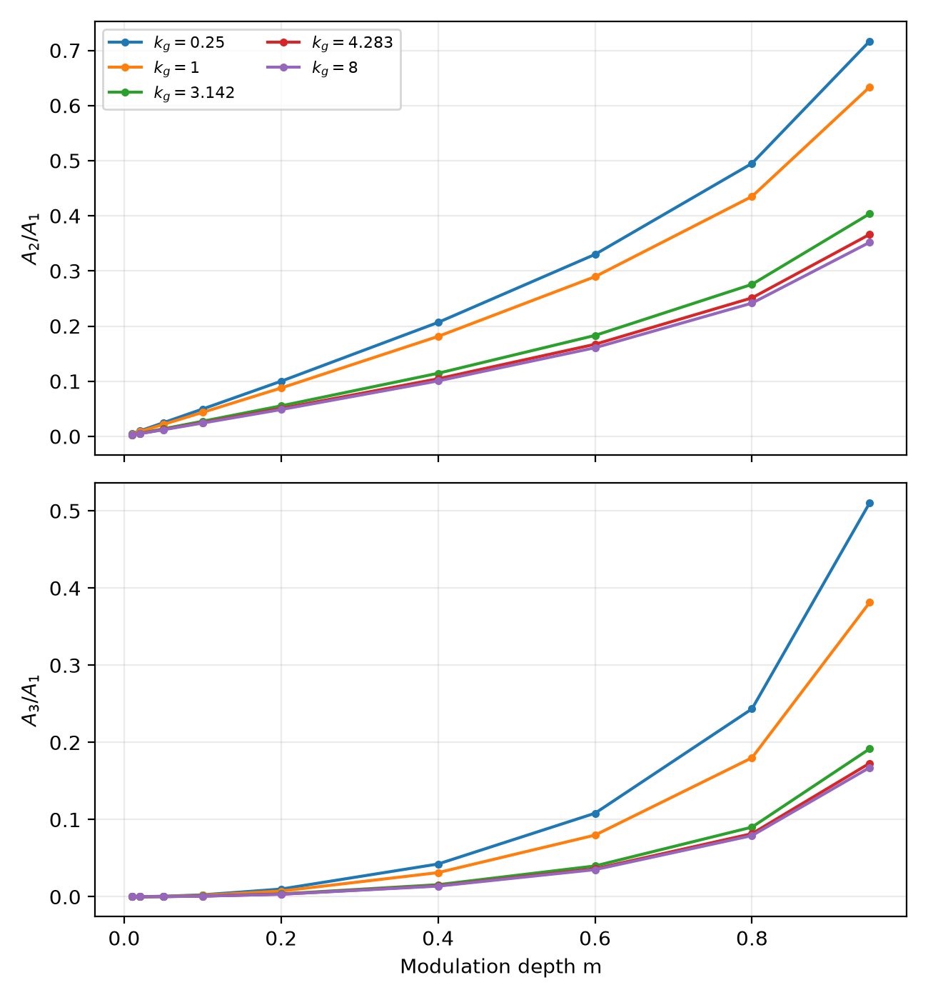

# Reduced PR material nonlinearity over grating frequency and contrast

## Scope and question

This material-only study tests whether the previously observed fundamental
enhancement at `kg=pi rad/um`, `m=0.95` is isolated or representative. It uses
the canonical reduced x-only nonlinear static equation and its existing direct
linearization for the prescribed frozen intensity

```text
I(x) = I0 [1 + m sin(kg x)],  I0 = 1.
```

The applied field and explicit background are zero. Every endpoint-excluded
periodic domain has exactly one period, `L=2*pi/kg`, and `N=512` samples. There
is no optical propagation, self-consistency, longitudinal history, GUI, or GPU
execution.

## Natural scale and sweep grid

Production uses the dimensionless coordinate `x'=k_D x`, with
`k_D=4.282893587390008 /um`. The natural dimensionless grating frequency is

```text
q = kg/k_D.
```

The physical grid follows the requested broad range but replaces the nearby
`4 rad/um` point with exact `k_D`, so the characteristic `q=1` scale is sampled
directly:

| `kg` (rad/um) | `kg/k_D` |
| ---: | ---: |
| 0.25 | 0.058372 |
| 0.50 | 0.116744 |
| 0.75 | 0.175115 |
| 1.00 | 0.233487 |
| 1.50 | 0.350231 |
| 2.00 | 0.466974 |
| pi | 0.733521 |
| 4.282893587 | 1.000000 |
| 6.00 | 1.400922 |
| 8.00 | 1.867896 |

The modulation grid is `0.01`, `0.02`, `0.05`, `0.1`, `0.2`, `0.4`, `0.6`,
`0.8`, and `0.95`. This yields 90 primary cases spanning sub-characteristic,
order-unity, and super-characteristic frequencies.

Because `kg x_j=2*pi*j/N` for every frequency, `K` through `5K` occupy exact
FFT bins 1 through 5. The convention is

```text
c_n = (1/N) sum_j [E_j - mean(E)] exp(-i 2*pi*n*j/N),
A_n = 2 |c_n|.
```

No windowing or interpolation is used.

## Fundamental map

All 90 cases have `R_K=A1_NL/A1_lin > 1`; this sampled plane contains no
sublinear region. The global minimum is `1.000025002` at
`kg=0.25 rad/um`, `m=0.01`, where the response is perturbatively near-linear.
The global maximum is `1.678413904` at `kg=k_D`, `m=0.95`.


At `m=0.95`, `R_K` ranges from `1.524241586` at `kg=0.25` to the maximum
`1.678413904` at `kg=k_D`. The original `kg=pi` point is `1.643537534`, exactly
reproducing the preceding one-period study. It is therefore a strong but not
exceptional point: enhancement of roughly 52--68% spans the entire sampled
frequency range at high contrast, and the maximum forms a broad region near
`kg/k_D=1--1.4` rather than a sharp isolated feature.


## Small-modulation coefficient

For each frequency, the four rows with `m<=0.1` were fitted to
`R_K-1=C(kg)m^2` through the origin. The fitted coefficient is positive
throughout:

| `kg` (rad/um) | `kg/k_D` | `C(kg)` |
| ---: | ---: | ---: |
| 0.25 | 0.058372 | 0.251206 |
| 0.50 | 0.116744 | 0.251288 |
| 0.75 | 0.175115 | 0.251606 |
| 1.00 | 0.233487 | 0.252339 |
| 1.50 | 0.350231 | 0.255468 |
| 2.00 | 0.466974 | 0.260617 |
| pi | 0.733521 | 0.274212 |
| 4.282893587 | 1.000000 | 0.282725 |
| 6.00 | 1.400922 | 0.284492 |
| 8.00 | 1.867896 | 0.279485 |

`C(kg)` rises gently from about `0.251` at low frequency, peaks at `0.284492`
near `kg/k_D=1.40`, and then decreases slightly. The relative RMS residual of
each quadratic fit is below `9.86e-4`.


The fitted power of `R_K-1` lies in `[2.002020, 2.002203]` across the frequency
grid. Corresponding absolute-amplitude powers are `[2.002020, 2.002166]` for
`A2` and `[3.003030, 3.003180]` for `A3`. No sampled frequency shows degraded
perturbative scaling.

## Higher harmonics and phase

Higher-harmonic ratios become large at high modulation and low frequency:

- the maximum `A2/A1=0.7167503` occurs at `kg=0.25`, `m=0.95`;
- the maximum `A3/A1=0.5104272` occurs at the same point;
- there, `A4/A1=0.3612925` and `A5/A1=0.2543055`, so truncation at `3K` would
  be misleading;
- at the original `kg=pi`, `m=0.95` point, the ratios are `0.4036674`,
  `0.1916860`, `0.1023884`, and `0.0585722` for `2K` through `5K`.




The maximum absolute nonlinear-minus-linearized fundamental phase difference is
`4.89e-15 rad`. This is numerical roundoff, so no phase heatmap is warranted:
the enhancement is magnitude-only throughout the sampled map.

## Resolution qualification

At `m=0.95`, `N=256`, `512`, and `1024` were compared at `kg=0.25`, `pi`, and
`8 rad/um`. The changes in `R_K` are:

| `kg` | `|R_256-R_512|` | `|R_512-R_1024|` | ratio |
| ---: | ---: | ---: | ---: |
| 0.25 | 9.765e-8 | 2.440e-8 | 4.002 |
| pi | 5.272e-5 | 1.318e-5 | 3.999 |
| 8.00 | 1.982e-4 | 4.953e-5 | 4.001 |

The factor-of-four reduction is the expected second-order centered-difference
convergence. The `N=512` to `1024` relative change is at most `3.01e-5`, despite
the physical sample spacing changing with `kg`; the frequency trend is not a
grid-spacing artifact.

All primary rows use the preceding study's residual tolerances, `1e-12` RMS
and `1e-11` maximum. On the clean baseline, the fine high-frequency Newton
roots stagnate at floating-point line-search resolution before satisfying that
RMS threshold. Only the `N=1024` resolution rows therefore use recorded
qualification tolerances of `5e-12` RMS and `2e-11` maximum. The worst accepted
fine-grid residual is `4.08e-12` RMS and `1.84e-11` maximum, far below the
observed discretization changes; no primary-map tolerance was relaxed.

## Qualitative literature comparison

In the usual qualitative terminology, this model exhibits superlinear response
throughout the sampled plane, near-linear behavior as `m` approaches zero, and
strong higher-harmonic regions at large `m`, especially for `kg/k_D << 1`. It
does not exhibit a sublinear locus here. This is only a terminology-level
comparison: no exact literature parameter matching was attempted, so the map
must not be presented as quantitative agreement with a different grating
model.

## Clean-source evidence and provenance

The authoritative calculation ran from an isolated clean checkout at exact
commit `c3edb6f46fb82a0e158b98fa599f49f406687a13`. The production checkout was
clean before and after execution. The finalized harness was supplied separately
and has SHA-256
`2b444cc7613e1c07cecdafc131f0b2c84f768d9aae2b8682f44aa0776b65b695`.
The evidence manifest SHA-256 is
`6d5a52eb2115215de38bff5a453aca4541c609fc7b6dd0e5e7376d56b27152ae`.

Canonical hashes are:

- scientific rows: `6860a68b0142a6e0e34190f244e3b78cddb7c6cfbfa65df47b42936d7c86317e`;
- small-modulation fits: `26f74e41cfbe5e58e0c8c6d449ebb07bcf231d43ffcf0b0d507cd11e0671c874`;
- resolution rows: `ac953c352b8f80b37f061f3498120680667fc17dbc752233d02e2a82da33b143`.

Compact evidence is retained under
`results/pr_reduced_material_kg_m_sweep_2026-09-11/`:

- `summary.csv`: all 90 primary scientific rows;
- `small_m_fits.csv`: `C(kg)` and perturbative exponents;
- `resolution.csv`: the nine resolution rows and explicit tolerances;
- `manifest.json`: configuration, clean-source state, versions, canonical
  hashes, and exact checksums for every CSV and PNG.

## Conclusion and limitations

The 64% enhancement at `kg=pi`, `m=0.95` is not an anomalous isolated point.
The reduced model predicts magnitude-only fundamental strengthening over the
entire sampled plane, with a broad maximum around the characteristic scale.
At high contrast, low-frequency gratings produce the strongest relative higher
harmonics even though their fundamental enhancement is somewhat smaller.

This is a one-period, zero-bias, one-dimensional material-only calculation. It
does not establish optical energy transfer, propagation behavior, universal
agreement with other photorefractive-grating models, or behavior outside the
sampled `kg` and `m` ranges.
