# Nonlinear harmonics of the reduced photorefractive material response

## Motivation

Two-beam photorefractive calculations combine material nonlinearity, optical
propagation, and self-consistent feedback. This note isolates the first of
those effects. It asks whether the canonical reduced nonlinear material
equation changes the Bragg-matched fundamental relative to its linearization,
how rapidly higher harmonics appear, and whether the tangent limit is recovered
as the imposed modulation becomes weak.

## Prescribed material problem

The frozen total normalized intensity is

```text
I(x) = I0 [1 + m sin(kx)],
I0 = 1,  k = pi rad/um.
```

One exact period occupies the endpoint-excluded periodic domain `L=2 um` with
`N=512`. The physical spacing is converted using the production material
normalization, `dx_normalized=k_D L/N`, where
`k_D=4.282893587390008 /um`. The applied field and explicit source background
are zero. The nine modulation depths are `0.01`, `0.02`, `0.05`, `0.1`, `0.2`,
`0.4`, `0.6`, `0.8`, and `0.95`.

For each prescribed intensity, the nonlinear response is the converged static
root of the canonical reduced production `hopping_rhs`. The linearized response
is the existing direct reduced x-only operator about `I0=1`, evaluated on the
same grid. There is no optical propagation, longitudinal history, or
optical/material self-consistency.

## Fourier analysis and perturbative expectation

For `n=1,2,3`, exact FFT bins are used:

```text
c_n = (1/N) sum_j [E_j - mean(E)] exp(-i 2*pi*n*j/N),
A_n = 2 |c_n|.
```

Thus `A_n` is the corresponding real-field sinusoidal amplitude. Phase
differences use `wrap(arg(c_1,NL)-arg(c_1,lin))` on `[-pi,pi)`. No windowing or
off-grid interpolation enters this test.

Linearization predicts `E_lin=O(m)`, an absolute nonlinear correction
`E_NL-E_lin=O(m^2)`, and `A1_NL/A1_lin -> 1`. Quadratic and cubic nonlinear
mixing should first generate `A2=O(m^2)` and `A3=O(m^3)`.

## Numerical results

The fundamental is strengthened monotonically. Its nonlinear/linearized ratio
rises from `1.000027282` at `m=0.01` to `1.643537534` at `m=0.95`.

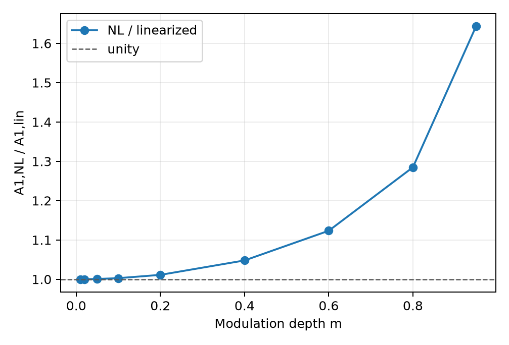

Higher harmonics grow simultaneously. `A2/A1` rises from `0.00273834` to
`0.40366741`; `A3/A1` rises from `8.947e-6` to `0.19168598`.

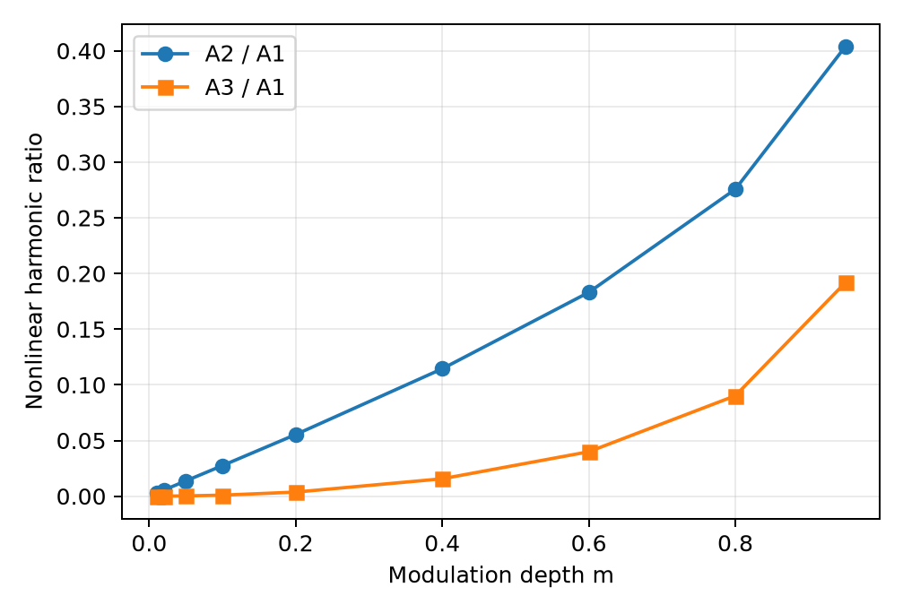

At `m=0.95`, the nonlinear amplitudes are `A1=0.74462135`, `A2=0.30057937`,
and `A3=0.14273347`. The linearized operator retains only the driven
fundamental apart from numerical roundoff.

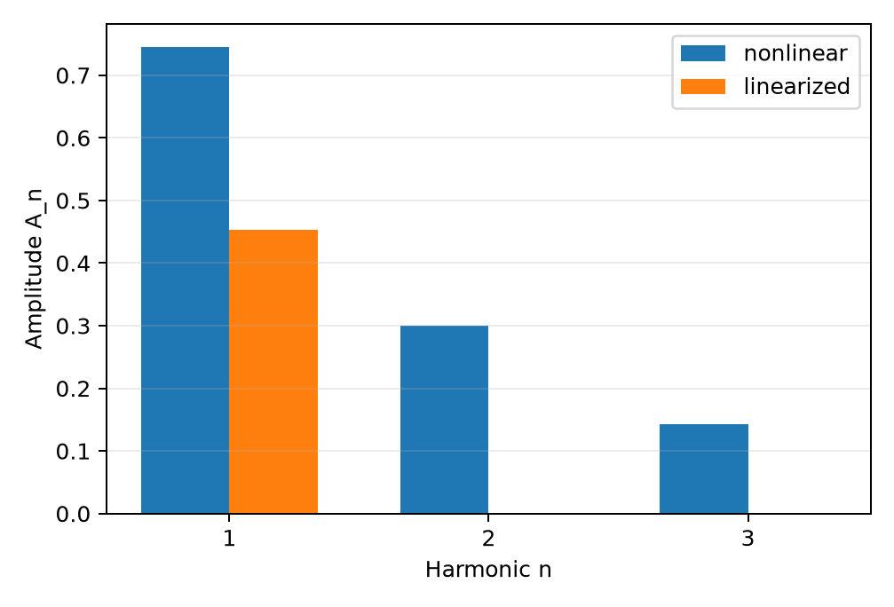

The corresponding phase-faithful decomposition uses the same convention as
the analysis above, reconstructing each real component as
`E_n(x_j)=2 Re[c_n exp(i 2*pi*n*j/N)]`. At `m=0.95`, the retained nonlinear
phases are `4.48e-16 rad` for `K`, `+pi/2` for `2K`, and `+pi` for `3K`; none
was shifted or aligned for presentation. The nonlinear fundamental is visibly
larger than the linearized fundamental, while the correctly phased `2K` and
`3K` components steepen and make the summed waveform asymmetric.

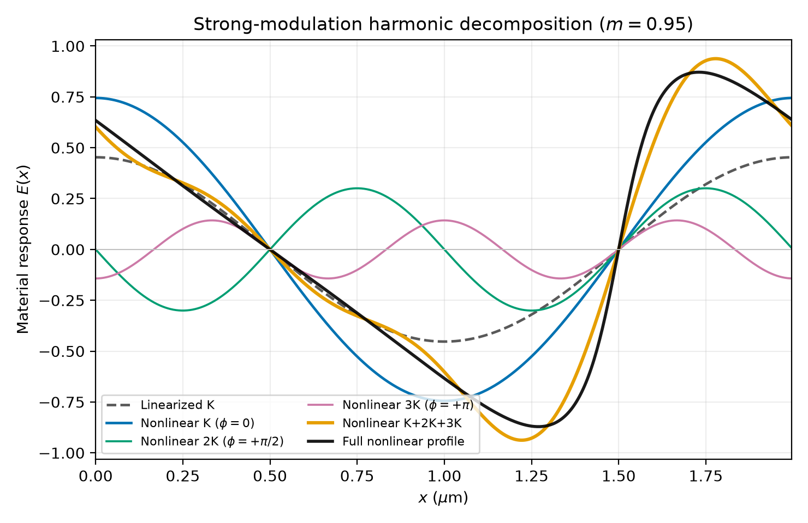

*At `m=0.95`, the linearized fundamental, nonlinear `K`, `2K`, and `3K`
components, their phase-faithful sum, and the full retained nonlinear profile
are shown on common axes. FFTs of the plotted components reproduce the retained
complex coefficients to better than `1e-15`. The three-harmonic sum leaves a
relative L2 residual of `0.1144401` and a maximum absolute residual of
`0.1638332` against the mean-removed full profile, so `4K` and higher harmonics
remain significant at this modulation.*

These amplitudes are not redistributed from a conserved "linear fundamental
budget." The nonlinear transport changes the fundamental Fourier coefficient
itself while simultaneously generating higher harmonics. Consequently, the
larger nonlinear `K` component and the distortion produced by `2K`, `3K`, and
higher orders coexist without implying that their amplitudes must sum to the
linearized fundamental amplitude.

The retained profiles show close agreement at `m=0.1`, visible harmonic shape
changes by `m=0.6`, and a strong nonsinusoidal response at `m=0.95`. Every panel
uses common nonlinear/linearized axes; the plotted values come from the retained
clean-source profile CSV rather than a plotting-time solver rerun.

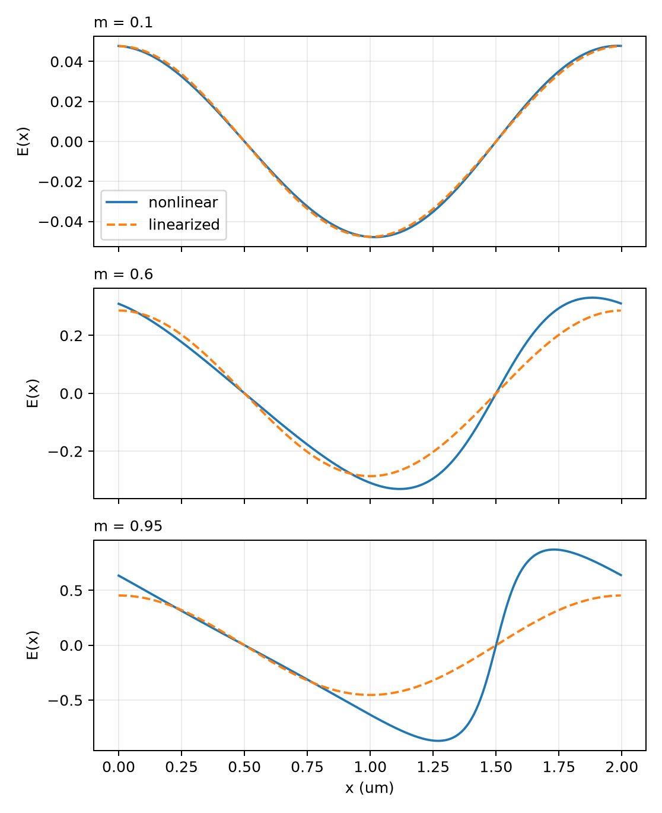

Fits over the four points with `m<=0.1` give:

| Quantity | fitted exponent |
| --- | ---: |
| `A1_NL/A1_lin - 1` | 2.002166 |
| RMS `E_NL-E_lin` | 2.004337 |
| relative L2 error | 1.004337 |
| `A2` | 2.002135 |
| `A3` | 3.003149 |

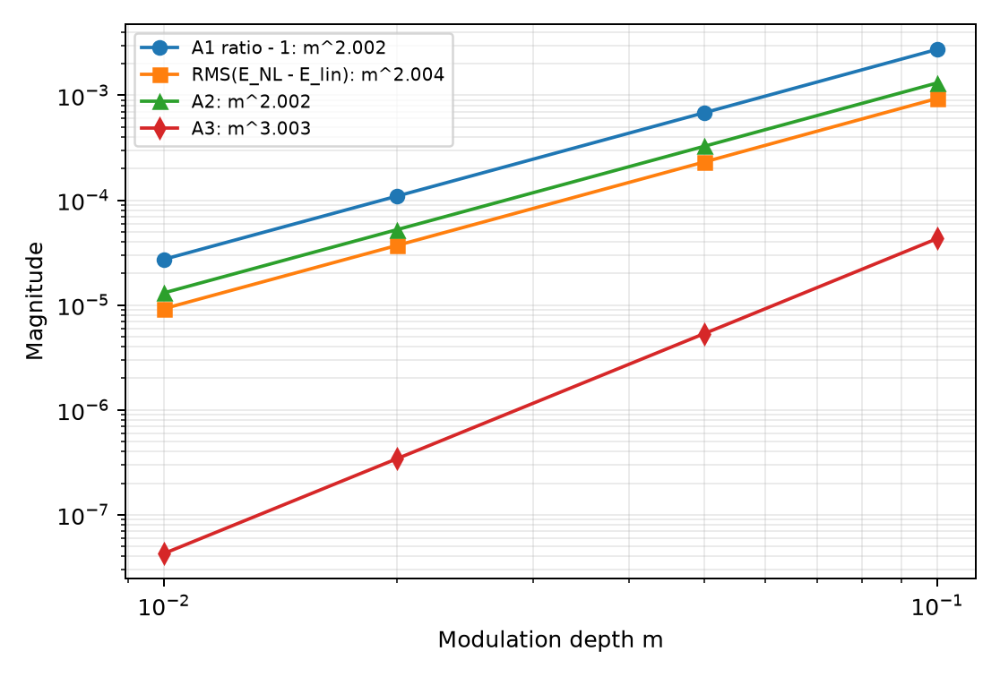

The absolute field correction is therefore quadratic. The relative L2 error is
linear because its denominator, the linearized material field, is itself
`O(m)`. The fundamental phase difference remains below `2.22e-15 rad` across
the sweep, so no resolved phase rotation accompanies the enhancement.

## Dependence on grating spatial frequency

The follow-on material map varies both modulation and grating frequency while
retaining one exact period and 512 samples per period. Production's
characteristic wavenumber is `k_D=4.282893587390008 /um`, and the sampled
dimensionless frequency `kg/k_D` runs from `0.0584` to `1.8679`. The same nine
modulations used above give 90 `(kg,m)` points.

All 90 sampled points have `R_K>1`. No sublinear region was found in this
zero-applied-field parameter slice. At `m=0.95`, the fundamental enhancement is
broadly `52--68%` across the frequency grid. The maximum is
`R_K=1.678413904` at `kg=k_D`; the original `kg=pi`, `m=0.95` point gives
`R_K=1.643537534`. The original point is therefore strong but not exceptional:
the high-contrast enhancement forms a broad band near the characteristic
screening/diffusion scale rather than an isolated peak.

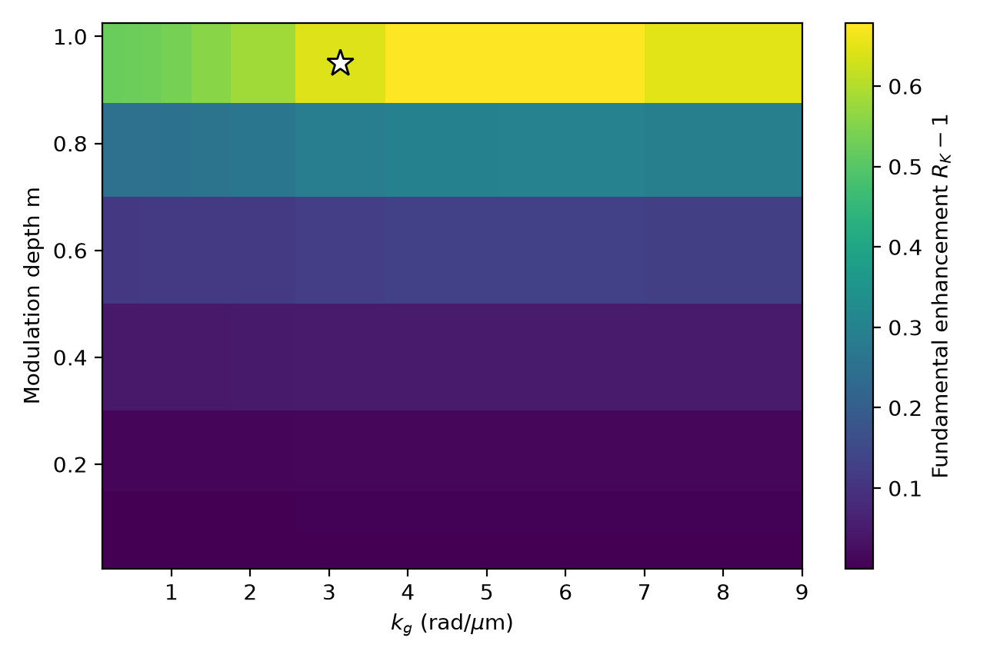

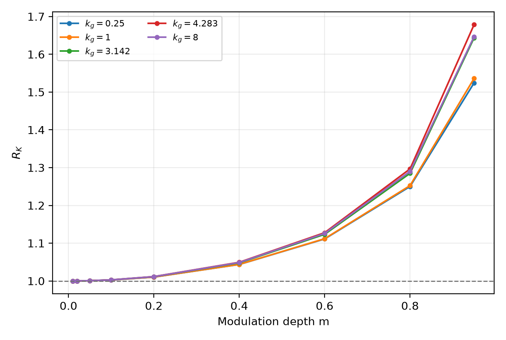

The low-modulation fit `R_K-1=C(kg)m^2` gives `C(kg)` between approximately
`0.251` and `0.284`. Thus the quadratic tangent correction holds across the
sampled frequency range, while its coefficient varies modestly with `kg`.

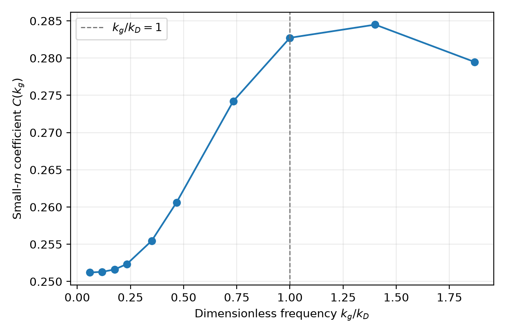

The fundamental phase remains unchanged to numerical precision throughout the
map: the largest absolute nonlinear-minus-linearized phase difference is
`4.89e-15 rad`. The most severe waveform distortion instead occurs at low
`kg` and high contrast. At `kg=0.25 rad/um`, `m=0.95`, the retained ratios reach
`A2/A1=0.7168`, `A3/A1=0.5104`, `A4/A1=0.3613`, and `A5/A1=0.2543`.
Consequently, even a `K+2K+3K` representation can be inadequate in that part
of the map.

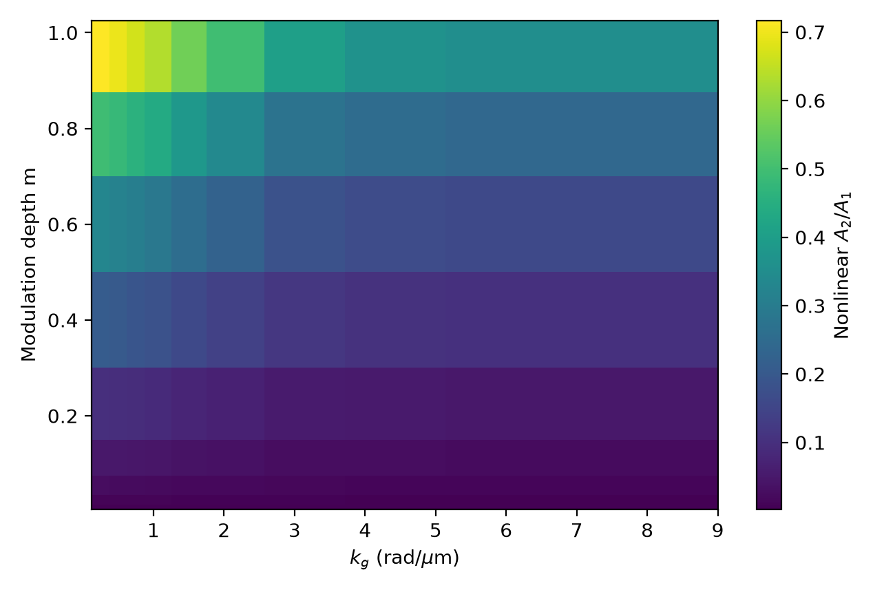

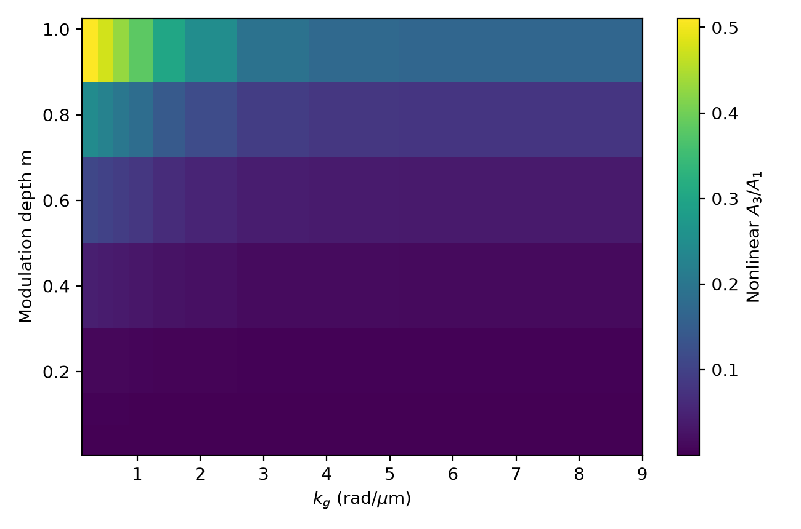

These findings demonstrate broad nonlinear enhancement only for the
zero-applied-field reduced model over this sampled domain. They do not imply
that every photorefractive parameter regime is superlinear. Applied bias and
other characteristic-field ratios can change the material balance and may
produce different behavior.

The frequency-map evidence was committed at
`32611475909033c147f7406ab9e233349db0add4`. Its manifest,
`results/pr_reduced_material_kg_m_sweep_2026-09-11/manifest.json`, has SHA-256
`6d5a52eb2115215de38bff5a453aca4541c609fc7b6dd0e5e7376d56b27152ae`
and binds the clean-source run, the 90-row CSV, fitted coefficients, resolution
rows, and all figures to the reviewed harness.

## Relation to two-beam coupling

The isolated result supplies a clean interpretation for more complicated
two-beam calculations: material nonlinearity can strengthen the Bragg-matched
fundamental while generating resolved higher harmonics, even without changing
the fundamental phase. The coexistence does not establish that either effect
alone causes a particular optical gain. Propagation, beam envelopes, carrier
separation, depletion, and self-consistent feedback are absent here and remain
essential in a coupled optical calculation.

For two-beam coupling and fanning, the practical implication is contrast
dependent. Small-signal response remains asymptotically linear, but a developed
high-contrast grating can have both a substantially stronger Bragg-matched
fundamental and strong higher harmonics. Finite-contrast coupling may therefore
exceed a prediction obtained by simply extrapolating the linearized gain
coefficient. This material-only result motivates that interpretation; it does
not replace optical propagation, carrier-resolved power, or fanning-specific
self-consistent evidence.

## Clean-source provenance

The calculation was executed once from an isolated clean checkout at exact
production commit `f534f0c7dabcae963688b8561bbfeb01b04f3869`. The finalized
harness was supplied outside that checkout and has SHA-256
`b07fc221902173b42d5c3b27bd6bf86749d8efb924dee0d4f799f10d3a30ee61`.
The clean checkout reported an empty `git status --porcelain=v1` before and
after execution.

The prior dirty-tree CSV has SHA-256
`9a91a09cc5cdf0c9cd9474b1b643d6c6ffba6016113a9220a7733f2feee2a10c`.
The regenerated clean CSV has the same hash. All requested scalar metrics and
all five fitted exponents are bitwise identical, so the uncommitted Newton
line-search condition did not affect this fixture or any scientific conclusion.

The retained manifest is
`results/pr_reduced_material_harmonic_sweep_2026-09-11/manifest.json`, SHA-256
`9e99324343d46d276b86e79f812ed87bf2db7c8966602ea3aa97cf552fd49d2a`.
It records canonical hashes for the nine scientific rows, 1,536 profile rows,
and nine complex spectrum rows, plus these artifact checksums:

| Artifact | SHA-256 |
| --- | --- |
| `summary.csv` | `9a91a09cc5cdf0c9cd9474b1b643d6c6ffba6016113a9220a7733f2feee2a10c` |
| `representative_profiles.csv` | `22b88db3390fe42365e5609522e44c26b1983da28fb7f8a11f77e0ca6d7e6ea7` |
| `representative_spectra.csv` | `148198a61c59d6b7e0f5319c325b84b873691ed92050fe541e0348a7d8827b56` |
| `fundamental_ratio_vs_modulation.png` | `a44e89df94d62472b39e31dfa7da47ea6a5a53d144b84301e3415decb96bb76b` |
| `harmonic_ratios_vs_modulation.png` | `c9e0177d6980d8b7064a6bae002835bd546f71756d17fc907ce67da461db72a7` |
| `small_m_scaling.png` | `7e3b19dd3ea1a350960bcae9a5a161f4d195a7262b7f7599ad4034f0e040ae3c` |
| `nonlinear_vs_linearized_profiles.png` | `4780a956b6e407bc826d58deb9980e5424307d7ddbbc09ccf287cc86c3e9b100` |
| `harmonic_spectrum_strong_modulation.png` | `c62ed9bf1d52c88776452eab4dc7680226141de534204c7e1ab6d429bc98b7d4` |

The phase-faithful decomposition figure was added later using only the retained
CSV evidence, without rerunning the material solver. Its SHA-256 is
`967879b5ab4d7b5120591c89bbeaff9acc2a3aaf6bfe138497fac456ab0ef4cd`.

## Limitations and conclusion

This is a single-period, zero-bias, one-dimensional, material-only test. It
does not establish optical energy transfer, orientation dependence, finite-beam
behavior, or a universal nonlinear ordering.

Within this controlled fixture, the nonlinear equation increasingly strengthens
the Bragg-matched fundamental as modulation grows, generates second- and
third-order harmonics with the expected perturbative powers, introduces no
detectable fundamental phase shift, and recovers the reduced linearized response
with the expected small-modulation scaling. The committed spatial-frequency map
shows that this magnitude enhancement is broad within the sampled zero-bias
reduced-model domain, while leaving open different behavior under applied bias
or other material parameter ratios.
