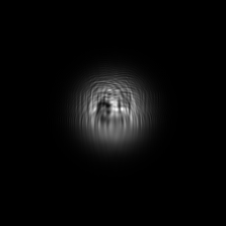
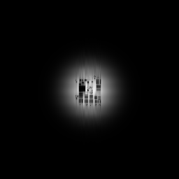

# Coupled-Static GPU Image-Amplification Pilot Report

**Lab notebook entry:** 2

**Date:** 2026-08-06

**Branch:** `feature/pr-second-order-static`

**Run status:** Passed

## Milestone Summary

- First successful coupled-static PR image-amplification calculation performed with LCProp.
- First bounded scientific use of the commissioned PR coupled-static workflow on a scheduler-assigned GPU.
- Combined the PR-owned static material solver with LCProp's shared beam launch, runtime grid, CuPy backend, and prepared optical-response interfaces.
- Converged every longitudinal slice using refreshed midpoint intensity and the complete PR residual.
- Passed an independent final optical replay with zero recorded field, source, and residual differences.
- Amplified the finite image-bearing signal by a factor of 4.58743 while reconstructing it with 0.99091 intensity correlation.
- Established a static reference for direct comparison with transient image-amplification job 2209653.

## Objective

This pilot was the first bounded research calculation to apply LCProp's coupled-static photorefractive workflow to image amplification. It used the same image, beam geometry, grid, material parameters, optical reconstruction, and metrics as the previously commissioned transient image-amplification pilot, Slurm job 2209653. The only intended physical-workflow change was replacement of material-time evolution by the coupled-static solution.

The calculation tested whether the slice-local static iteration could converge a finite coherent pump and image-bearing signal, replay the assembled space-charge field independently, preserve total optical power, amplify the signal, and retain the encoded spatial information. It also provided the first directly comparable static and finite-time transient results for this configuration.

The pilot was not a grid-convergence study or a paper-scale benchmark. Agreement between the static and transient observables is informative, but one finite-time transient calculation cannot establish approach to the static limit.

## Software and Reproduction Identity

| Item | Recorded value |
|---|---|
| Git checkout | `a51d48b5c9a80b64516735f1e9445001703ce72e` |
| Repository | `/cluster/tufts/cglab/mcroning/LCProp` |
| Pilot driver | `scripts/checks/pr_static_image_amplification_gpu_pilot.py` |
| Pilot-driver SHA-256 | `40b3029cdaa660d193f2de828924ff963f0b6da0e8417a9ab56ffbcaa02477b6` |
| Slurm script | `/cluster/tufts/cglab/mcroning/lcprop_runs/lcprop_pr_static_image_pilot.sbatch` |
| Slurm-script SHA-256 | `ca386a152f409e7ae01d408316c5d050dc793f0f9dc9810df4d3543d3f35f426` |
| Input image | `/cluster/tufts/cglab/mcroning/lcprop_runs/inputs/AF_Res_Chart.png` |
| Input-image SHA-256 | `e424f1070587d79d2a91f4a3bd14e7c11e80adfe7c723e45432d9d4fc5bb85b7` |
| Transient reference | `docs/research/assets/pr_gpu_image_amplification_pilot_2026-08-05/metrics.json` |
| Transient-reference SHA-256 | `1f686ec06875b66d19b20c87b8108684b971ef9afbd35dde963c91979e3eb9b9` |
| Python executable | `/cluster/tufts/cglab/mcroning/condaenv/prenv/bin/python` |
| LCProp import | `/cluster/tufts/cglab/mcroning/LCProp/src/lcprop/__init__.py` |
| CUDA module | `cuda/12.9.0` |
| Persistent run directory | `/cluster/tufts/cglab/mcroning/lcprop_runs/static-image-pilot-2222684` |
| Compute-node scratch directory | `/tmp/lcprop-pr-static-image-2222684` |

The exact submission command was:

```bash
ssh -o BatchMode=yes mcroning@login.pax.tufts.edu \
  'sbatch --parsable /cluster/tufts/cglab/mcroning/lcprop_runs/lcprop_pr_static_image_pilot.sbatch'
```

Within the allocation, the scientific payload was:

```bash
/cluster/tufts/cglab/mcroning/condaenv/prenv/bin/python \
  scripts/checks/pr_static_image_amplification_gpu_pilot.py \
  --image /tmp/lcprop-pr-static-image-2222684/AF_Res_Chart.png \
  --td-reference-metrics \
    docs/research/assets/pr_gpu_image_amplification_pilot_2026-08-05/metrics.json \
  --output-dir /tmp/lcprop-pr-static-image-2222684/products \
  --output-json /tmp/lcprop-pr-static-image-2222684/metrics.json
```

The Slurm script required exact agreement of the Git, driver, input-image, and transient-reference checksums before invoking the payload. It prepended the detached checkout's `src` directory to `PYTHONPATH`, preventing the stale-site-packages import issue diagnosed during static GPU commissioning.

The compact machine-readable [metrics record](assets/pr_coupled_static_image_amplification_pilot_2026-08-06/metrics.json) and [provenance record](assets/pr_coupled_static_image_amplification_pilot_2026-08-06/provenance.txt) accompany this report.

## Cluster Configuration

| Item | Value |
|---|---:|
| Slurm job ID | `2222684` |
| Scheduler result | `COMPLETED`, exit code `0:0` |
| Compute node | `pax009` |
| Partition / QOS / account | `gpu` / `normal` / `default` |
| Nodes / tasks | 1 / 1 |
| CPUs per task | 2 |
| Requested host memory | 16 GiB |
| Requested wall time | 10 minutes |
| Requested GPUs | 1 |
| Scheduler elapsed time | 22 seconds |
| GPU | NVIDIA H200 |
| CUDA-visible device | 0 |
| Scheduler GPU identifier | 3 |
| Compute capability | 9.0 |
| NVIDIA driver | 575.57.08 |
| CUDA driver API | 12.9 |
| CUDA runtime API | 12.9 |
| CUDA compiler | 12.9.41 |
| CuPy | 13.6.0 |
| Python | 3.10.4 |
| NumPy / SciPy | 2.1.0 / 1.15.2 |

LCProp requested and reported `backend=cupy` with `is_gpu=true`. CuPy reported one visible device and identified it as the scheduler-assigned NVIDIA H200. No NumPy fallback was accepted or observed.

## Numerical Method

The calculation used the PR-owned coupled-static workflow with the normalized space-charge field `E(z,x,y)` as the material state. At each longitudinal slice, the accepted incoming optical field was held fixed while the workflow iterated the material state and refreshed the midpoint optical intensity. Convergence required both RMS and maximum norms of the complete PR residual evaluated with that refreshed intensity.

Each fixed-intensity material update used the backend-native batched cyclic-tridiagonal Newton solver. The outer coupled iteration used damped block Picard/Gauss-Seidel updates with backtracking on the refreshed coupled residual. A small state change was not accepted as proof of convergence. Each slice was warm-started from the previously accepted material slice.

After the sequential solve, the workflow independently replayed the launch field through the assembled `E(z,x,y)` volume. The replay recomputed the midpoint source intensity and complete residual without reusing the sequential optical fields. Field, source, residual, and residual-convergence checks were required before the run could pass operationally.

For each optical advance, PR-owned code converted `E` to multiplicative complex half-step screens and called `advance_prepared_response()`. The optical pass therefore used frozen-response Strang splitting through the shared material-neutral propagation seam.

The coherent pump and image signal occupied grid-commensurate transverse Fourier carriers. Signal power was measured by Fourier-mode assignment to the known carriers rather than by spatial masks. Image fidelity was evaluated after isolating the signal carrier and linearly back-propagating it to the input plane. A zero-PR-response propagation provided the reconstruction control.

The transverse material and optical boundaries were periodic. No apodization, scattering noise, checkpoint continuation, or GUI path was used.

## Pilot Parameters

| Parameter | Value |
|---|---:|
| Transverse grid | 256 × 256 |
| Transverse aperture | 256 × 256 µm |
| Transverse spacing | 1 × 1 µm |
| Interaction length | 400 µm |
| Longitudinal spacing | 20 µm |
| Longitudinal slices | 20 |
| Wavelength | 0.633 µm |
| Refractive index | 2.4 |
| Beam waist | 48 µm |
| Samples per waist | 48 |
| Positive carrier mode | 8 |
| Samples per two-beam grating period | 16 |
| Signal-to-pump input peak ratio | 0.001 |
| Target saturated small-signal gain | 10 |
| Signal gain sign | +1 |
| Equivalent dark intensity | 0.05 |
| Characteristic wavenumber | 0.5 µm⁻¹ |
| Applied field | 0 |
| Image inversion | Disabled |
| Arithmetic | `float64` / `complex128` |

The source image was the same Air Force resolution chart used by transient job 2209653. Its decoded shape was 216 × 255 pixels. It was normalized and mapped onto the 256 × 256 optical grid through the same image-construction path as the transient pilot.

The comparative request record retains `Nt=200` and `dt_normalized=0.05`, but the static workflow did not use either transient control.

### Static Solver Controls

| Control | Value |
|---|---:|
| Maximum coupled passes per slice | 20 |
| Maximum backtracks | 16 |
| Minimum step scale | `2⁻¹⁶` |
| Armijo fraction | `1e-4` |
| Optical substeps | 1 |
| Coupled residual RMS tolerance | `1e-8`, precision default |
| Coupled residual maximum tolerance | `1e-7`, precision default |
| Fixed-intensity residual RMS tolerance | `1e-10`, precision default |
| Fixed-intensity residual maximum tolerance | `1e-9`, precision default |
| Replay relative tolerance | `1e-11`, precision default |
| Replay absolute tolerance | `1e-12`, precision default |

## Coupled Convergence and Replay

| Diagnostic | Result |
|---|---:|
| Completed slices | 20 of 20 |
| Converged slices | 20 of 20 |
| Coupled iteration records | 80 |
| Accepted coupled updates | 80 |
| Rejected coupled updates | 0 |
| Maximum coupled passes used | 4 |
| Maximum final slice residual RMS | `1.8952234470814792e-10` |
| Maximum final slice residual maximum | `4.352205699997835e-09` |
| Termination reason | `residual_tolerance` |
| Replay residual RMS | `1.7673465280730444e-10` |
| Replay residual maximum | `4.352205699997835e-09` |
| Replay field maximum difference | `0.0` |
| Replay source maximum difference | `0.0` |
| Replay residual maximum difference | `0.0` |

Every slice converged in four coupled passes. The maximum recorded RMS and maximum residuals were below their precision-resolved tolerances. The independently replayed optical fields, refreshed midpoint sources, and residuals matched the sequential results exactly at the recorded host precision.

## Figures

### Input target and launched signal

| Input target | Image-bearing input signal |
|---|---|
|  |  |

These input products are byte-identical to the corresponding transient-pilot assets, so the established copies are reused rather than duplicated.

### Static output and reconstructed signal

| Isolated signal at the output plane | Back-propagated static reconstruction |
|---|---|
|  |  |

The isolated output signal contains propagation and carrier structure. After back-propagation, the central target and surrounding bar groups are recovered within the finite Gaussian illumination envelope.

### Zero-response reconstruction control


The zero-response product is byte-identical to the previously preserved control. Its correlation with the image-bearing input signal is exactly 1.0.

## Scientific Metrics

| Metric | Static result | Pilot criterion |
|---|---:|---:|
| Measured finite-image absolute signal gain | 4.587429083811026 | > 1.1 |
| Ideal plane-wave analytic gain | 9.910891089108912 | Reference only |
| Image-intensity correlation | 0.9909092551464946 | ≥ 0.8 |
| Zero-response image-intensity correlation | 1.0 | within `2e-12` of 1 |
| Normalized image RMSE | 0.16215489277430692 | ≤ 1.0 |
| Relative total-power drift | −2.220446049250313 × 10⁻¹⁵ | absolute value ≤ `1e-9` |
| Finite numerical outputs | Yes | Required |

All predeclared scientific controls were satisfied. Their classification was evaluated only after every operational convergence, replay, backend, finiteness, and power-conservation gate had passed.

The negative power-drift sign denotes a negligible decrease; acceptance used its absolute magnitude. Conservation at the `2.22e-15` relative level confirms the internal consistency of the phase-only optical propagation for this calculation. It does not independently validate the PR material model.

The finite-image gain and ideal plane-wave analytic gain are not expected to agree. The analytic value is a coupled-wave scale and sign reference, whereas this calculation used finite Gaussian beams, a spatially encoded signal, and a finite periodic aperture.

## Comparison with Transient Job 2209653

The static and transient calculations used the same image, optical geometry, grid, material parameters, and reconstruction metrics. The transient reference evolved the material for 200 steps at `dt=0.05`, corresponding to normalized time 10. The static calculation solved the coupled stationary equations directly.

| Metric | Coupled static | Transient | Static minus transient |
|---|---:|---:|---:|
| Measured signal gain | 4.587429083811026 | 4.51124753468667 | +0.07618154912435582 |
| Image correlation | 0.9909092551464946 | 0.9897689452600813 | +0.0011403098864133376 |
| Normalized RMSE | 0.16215489277430692 | 0.18040825934966398 | −0.01825336657535706 |
| Relative power drift | −2.220446049250313e-15 | −2.3314683517128287e-15 | +1.1102230246251565e-16 |
| Zero-response correlation | 1.0 | 1.0 | 0.0 |

The static gain was approximately 1.69% greater than the transient value. The static reconstruction had slightly higher correlation and lower normalized RMSE. These differences are small for the declared observables, but the transient comparison was not an acceptance criterion and does not establish that normalized time 10 is fully relaxed. A material-state comparison across additional transient times would be needed to make that claim.

## Timing

| Measurement | Seconds |
|---|---:|
| Cold CuPy initialization | 1.094583397731185 |
| Synchronized GPU execution | 13.582470587454736 |
| Coupled-static workflow | 13.521903901360929 |
| Reconstruction optical propagation | 0.01121567003428936 |
| Complete reconstruction | 0.016619741916656494 |
| Benchmark calculation | 13.5385299064219 |
| Pilot script wall time | 14.736743033863604 |
| Slurm elapsed time | 22 |

The timings include first-use GPU and kernel initialization effects and are not performance benchmarks. The geometrically similar CPU preflight used a 64 × 64 grid and five longitudinal slices; it was an operational pipeline check rather than a valid CPU/GPU performance comparison.

## Memory and Storage

| Measurement | Value |
|---|---:|
| GPU total memory visible to CuPy | 150,110,273,536 bytes |
| GPU free memory before run | 149,555,707,904 bytes |
| GPU free memory after run | 149,438,267,392 bytes |
| CuPy pool peak proxy | 112,737,792 bytes, approximately 107.5 MiB |
| CuPy pool used after run | 0 bytes |
| Slurm batch MaxRSS | 133,620 KiB |
| One `float64` `E(z,x,y)` state estimate | 10,485,760 bytes |
| Persistent result directory | approximately 560 KiB |
| Retrieved directory including logs | approximately 584 KiB |

The CuPy pool value is an allocator-pool proxy rather than a continuously sampled hardware high-water mark. The pilot used a small fraction of the available H200 memory.

## Qualitative Reconstruction

The reconstructed signal preserved the principal Air Force chart structure, including the central target and surrounding bar groups, within the finite Gaussian envelope. Fine features were softened and the outer chart was suppressed by the illumination profile. The output-plane isolated signal retained stronger propagation and carrier structure, as expected before back-propagation.

The zero-response reconstruction was byte-identical to the input-signal PNG and had correlation 1.0. This directly controlled the Fourier carrier isolation, forward diffraction, and inverse reconstruction path.

The static output and reconstruction are preserved with this report. Byte-identical input and zero-response products reuse the established transient-report assets.

## What Was Validated

For this single 256 × 256 × 20 `float64` case, the pilot validated:

- scheduler-assigned H200 execution through CuPy;
- import from the exact detached LCProp checkout;
- execution of the production backend-native cyclic material solver;
- complete coupled-static convergence at every longitudinal slice;
- convergence based on refreshed midpoint intensity and both residual norms;
- independent replay agreement for optical fields, source intensity, and PR residuals;
- finite-image signal amplification with the expected gain direction;
- Fourier-mode signal measurement and matched reconstruction;
- exact zero-response reconstruction control;
- total-power conservation at a relative drift of `−2.22e-15`;
- direct metric comparison with transient job 2209653;
- capture and retrieval of provenance, metrics, stdout, stderr, exit status, and compact products.

## What Was Not Validated

The pilot did not establish:

- longitudinal or transverse grid convergence;
- aperture or periodic-boundary independence;
- uniqueness of the nonlinear static solution;
- convergence from substantially different material initial guesses;
- agreement of the complete static material state with a long-time transient state;
- difficult nonlinear regimes or broader parameter dependence;
- continuation or checkpoint workflows;
- execution through generic workers, products, or persistence dispatch;
- GUI construction or visualization;
- performance scaling or CPU/GPU speedup;
- paper-scale image-amplification agreement.

The result should therefore be read as a successful bounded static image-amplification pilot, not as a completed convergence or physical-validation study.

## Data Preservation

The following compact text artifacts accompany this report:

- `metrics.json`, SHA-256 `903a43d03ec3b7f8f580b5e4bd04935fc0b1705442882699e8221df3a3a34980`
- `provenance.txt`, SHA-256 `01370ef34bbc4b2cbfee924378a9efac0740cdf3aec501e123d875496892d43e`

The committed provenance removes one whitespace-only line emitted by the module command. The retrieved raw provenance has SHA-256 `7df217823dd438077f6e005f160af947a73c1db1456e9dcf454a84bcd561ce74`; its substantive content is unchanged.

The following byte-identical controls reuse the existing transient-report assets:

- `input_target.png`, 5,649 bytes, SHA-256 `effdc3569ffd9bcce2f7038b7ac46e49d2a400c2627cad5e03172021458c81cb`
- `input_signal.png`, 7,915 bytes, SHA-256 `f3d888387c69fb430cbcf89abe3a199383e65b1772cb0eff2d64ee33917afcfd`
- `zero_response_reconstruction.png`, 7,915 bytes, SHA-256 `f3d888387c69fb430cbcf89abe3a199383e65b1772cb0eff2d64ee33917afcfd`

The following static visual products are committed beside this report:

- `output_signal.png`, 7,998 bytes, SHA-256 `623dc68084a3fdd58086daff4292dbb206ceed9186af6361583e65ab17a042e7`
- `reconstructed_signal.png`, 6,352 bytes, SHA-256 `88fd12d90d61ebf57d2339027ce870b69b5853c942fbe82ce0d1ee5f1c221556`

The following numerical arrays are intentionally excluded from Git:

- `E_final_midplane.npy`, 262,272 bytes, SHA-256 `c6c54ab0c3a7bb34c03f01f0d1579069bf74958b5788003fb29d0bde5b11f5fa`
- `reconstructed_signal_intensity.npy`, 262,272 bytes, SHA-256 `eee00ee0f55c9f0a77ab81172ea520a8fc90eb609387dfd58cc6f501813dc444`

Scheduler stdout is byte-identical to `metrics.json`. Scheduler stderr was empty. The complete remote evidence remains at:

```text
/cluster/tufts/cglab/mcroning/lcprop_runs/static-image-pilot-2222684
/cluster/tufts/cglab/mcroning/lcprop_runs/lcprop-pr-static-image-2222684.stdout
/cluster/tufts/cglab/mcroning/lcprop_runs/lcprop-pr-static-image-2222684.stderr
```

A retrieved working copy was stored at `/private/tmp/lcprop-pr-static-image-pilot-2222684` when this report was prepared. That temporary path is not a durable archive.

## Execution Note

The first final pre-submission verification command contained a shell-quoting error while extracting the script checksum. It terminated before submission and changed no state. The corrected read-only verification passed, after which exactly one job was submitted. No retry or parameter change occurred.

## Scientific Significance

This milestone establishes the first GPU image-amplification result from LCProp's coupled-static PR workflow. It demonstrates that the production cyclic solver, refreshed-source coupled iteration, independent optical replay, shared prepared-response propagator, and image reconstruction operate together for a finite scientific case on production GPU hardware.

The result also provides the first direct static reference for the previously commissioned transient image-amplification calculation. Their close gain and image-quality metrics support continued comparison, while the remaining difference appropriately motivates controlled convergence work rather than a claim of equivalence.

## Conclusion

The first coupled-static PR image-amplification pilot performed with LCProp passed operational and scientific acceptance. At exact Git SHA `a51d48b5c9a80b64516735f1e9445001703ce72e`, all 20 material slices converged, the independent replay matched the sequential solution exactly at recorded precision, the signal was amplified by 4.58743, the reconstructed image reached 0.99091 correlation and 0.16215 normalized RMSE, and total optical power drifted by only `−2.22e-15`.

The static observables were close to transient job 2209653, with 1.69% greater signal gain and slightly improved reconstruction metrics. This is a successful reference calculation, but not yet evidence of grid convergence, solution uniqueness, or complete transient relaxation.

## Recommended Next Experiment

Perform a bounded longitudinal-resolution study while holding the 256 × 256 transverse grid, 256 µm aperture, source image, beam geometry, material parameters, backend, reconstruction method, and static solver policy fixed. Use `dz = 40, 20, 10 µm`, corresponding to 10, 20, and 40 longitudinal slices, with this `dz=20 µm` pilot as the existing midpoint.

Compare measured signal gain, image correlation, normalized RMSE, total-power drift, maximum coupled residuals, coupled passes per slice, replay differences, output optical field, and final material state. Interpret the series as longitudinal discretization evidence only. Transverse resolution, aperture, nonlinear initial guess, and transient material time should be varied separately in later studies.

---

End of lab notebook entry.
