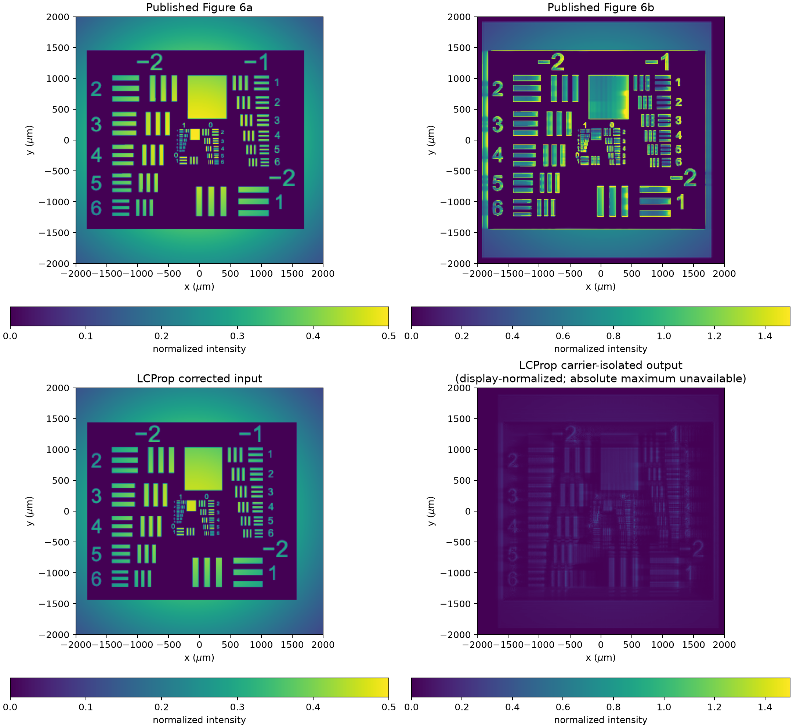
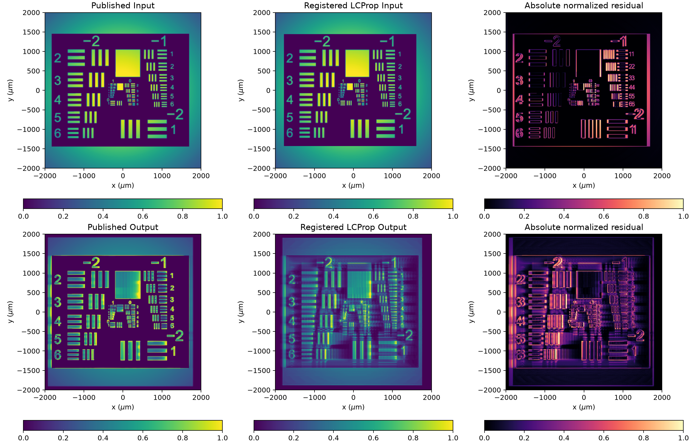

# Corrected PR Figure 6 Reproduction and Direct Panel Comparison

**Date:** 2026-08-07

**Branch:** `feature/pr-second-order-static`

**Git SHA:** `4e82d997ba5c227f5296b8dc5f22dccc0b18ede7`

**Slurm job:** `2231455`

**Classification:** Operationally successful corrected-request calculation; normalized structural comparison complete; exact published output reproduction not established

## Milestone Summary

- Completed the first paper-scale Figure 6 calculation using the corrected
  published Air Force transparency polarity.
- Executed all 2,175 longitudinal slices on an NVIDIA A100 using the
  explicitly selected legacy-linearized spectral material solve and legacy
  Lie optical ordering.
- Verified the exact Git revision, CuPy backend, input checksum, clean checkout,
  and bitwise-consistent deterministic replay.
- Confirmed that the corrected LCProp input agrees closely with published
  Figure 6a after the documented presentation transform.
- Compared the carrier-isolated LCProp output directly with published Figure
  6b using the same crop, field of view, orientation, and normalized structural
  presentation.
- Found recognizable output structure but not an exact reproduction of the
  published output.

## Objective

This calculation closes the output-panel gate established by the Figure 6
request-correction milestone. It propagates the corrected request at the full
published grid and compares the resulting carrier-isolated signal with the
published Figure 6 panels.

The work does not change the PR equation, optical propagation, production
solver, carrier filter, or image-processing implementation. Its purpose is to
evaluate the corrected request before beginning the planned full-nonlinear Lie
and production-Strang comparisons.

## Reproduction Record

| Item | Value |
|---|---|
| Cluster | Tufts PAX |
| Scheduler | Slurm |
| Job | `2231455` |
| Node | `pax003` |
| Git SHA | `4e82d997ba5c227f5296b8dc5f22dccc0b18ede7` |
| Checkout | `/cluster/tufts/cglab/mcroning/LCProp` |
| LCProp import | `/cluster/tufts/cglab/mcroning/LCProp/src/lcprop/__init__.py` |
| Python | `/cluster/tufts/cglab/mcroning/condaenv/prenv/bin/python` |
| CUDA module | `cuda/12.9.0` |
| CuPy | `13.6.0` |
| GPU | NVIDIA A100 PCIe 40 GB |
| Payload | `/cluster/tufts/cglab/mcroning/lcprop_runs/pr_figure6_corrected.py` |
| Payload SHA-256 | `76ca628ae5cbf5e03cfa490b3a70f99b138190a63208d3c8d892a5bb55b21d24` |
| AF chart SHA-256 | `e424f1070587d79d2a91f4a3bd14e7c11e80adfe7c723e45432d9d4fc5bb85b7` |
| Remote run directory | `/cluster/tufts/cglab/mcroning/lcprop_runs/pr-figure6-corrected-2231455` |
| Local retrieval directory | `/private/tmp/lcprop-pr-figure6-corrected-2231455` |

The complete compact [run metrics](assets/pr_figure6_corrected_reproduction_2026-08-07/run_metrics.json)
and [provenance](assets/pr_figure6_corrected_reproduction_2026-08-07/provenance.txt)
are preserved with this record.
The repository copy of the provenance normalizes one whitespace-only blank
line; `comparison_metrics.json` records the SHA-256 of the original retrieved
file.

## Physical and Numerical Request

| Parameter | Value |
|---|---:|
| Grid | 16,384 × 2,048 × 2,175 |
| Aperture | 4,000 µm × 4,000 µm |
| Interaction length | 4,350 µm |
| Longitudinal step | 2 µm |
| Wavelength | 0.514 µm |
| Refractive index | 2.4 |
| External half-angles | ±7.56° |
| Periodic carrier mode | 1,024 |
| Grating samples per period | 8 |
| Beam waists | 3,400 µm |
| Input peak-intensity ratio | 1 |
| Saturated small-signal gain | 4,000 |
| Derived gain-length product | −4.31151372731 |
| Dark intensity | 0.01 |
| Applied field | 0 |
| Tukey alpha | 0.05 |
| Volume noise | Disabled |
| Transparency polarity | Inverted before embedding |

The image-bearing input is the checksummed Air Force chart converted to
grayscale, normalized, inverted in source coordinates, padded with transparent
exterior, rotated into LCProp's array convention, and resized with
nearest-neighbor interpolation. The signal amplitude is multiplied by the
square root of this intensity transparency.

The selected workflow mode is
`legacy_linearized_spectral_lie`. Each slice uses the PR-owned spectral
solution of the legacy linearized material equation, followed by the legacy
full-diffraction/full-response Lie ordering and the trusted Tukey window. This
is a named reference mode rather than the production full-nonlinear
coupled-static solver.

## Operational Result

| Quantity | Result |
|---|---:|
| Slurm state | `COMPLETED` |
| Process exit code | 0 |
| Completed slices | 2,175 / 2,175 |
| Scheduler elapsed time | 1,047 s |
| Synchronized calculation time | 1,016.439 s |
| Total payload time | 1,036.560 s |
| Cold CuPy initialization | 0.620 s |
| Host peak RSS | approximately 9.0 GiB |
| CuPy pool allocation | approximately 17.18 GB |
| Stderr | empty |
| Actual backend | CuPy, float64/complex128 |
| Deterministic replay | bitwise consistent |

The workflow status is `converged` with respect to the governing residual of
the explicitly selected legacy-linearized equation. The separately recorded
full-nonlinear residual is not small and is not used to claim convergence of
the complete nonlinear hopping equation.

## Published Presentation

The published panels use carrier-isolated signal intensity over the complete
4 mm square aperture. Figure 6a uses a linear `viridis` scale from 0 to 0.5;
Figure 6b uses a linear scale from 0 to 1.5. The published raster data regions
are extracted at:

- Figure 6a: publication pixels `[95:734, 282:921]`;
- Figure 6b: publication pixels `[89:728, 282:921]`.

LCProp's persisted raster is horizontally reflected into the published panel
orientation. The published values are recovered by nearest lookup in a
4,096-entry `viridis` table.

The LCProp payload saved its carrier products as independently normalized
eight-bit PNGs. The input can be restored to the known 0-to-0.5 convention,
but the absolute maximum of the output carrier was not preserved. The LCProp
output panel below is therefore display-normalized to the published 0-to-1.5
range. It is a spatial-structure comparison, not an absolute-intensity
validation.

## Direct Panel Comparison

The corrected input now has the published dark chart field, bright features,
and transparent Gaussian exterior. The output retains the chart and shows
edge enhancement, but its contrast distribution and fine structure differ
substantially from the published output.

## Registered Normalized Comparison

Each panel was robustly mapped to `[0,1]` using its 0.5th and 99.5th
percentiles. Registration used only the documented horizontal reflection and
a bounded ±24-publication-pixel periodic translation in each axis.

| Comparison | Pearson correlation | Normalized RMSE | Edge correlation | Shift `(y,x)` pixels |
|---|---:|---:|---:|---:|
| Corrected input | `0.80804` | `0.19101` | `0.45735` | `(−1, +6)` |
| Carrier-isolated output | `0.38655` | `0.26064` | `0.27976` | `(−2, −24)` |

The input registration is internal to the allowed range and independently
confirms the corrected launch convention. The output optimum reaches the
horizontal search boundary. Its registration is therefore not considered a
stable physical alignment, and the output correlation must be treated as a
descriptive upper-bound result rather than a validation threshold.

Machine-readable comparison details and source checksums are preserved in
[comparison_metrics.json](assets/pr_figure6_corrected_reproduction_2026-08-07/comparison_metrics.json).

## Run-Level Metrics

| Metric | Value |
|---|---:|
| Measured absolute signal gain | `2.73377` |
| Analytic plane-wave signal gain | `1.99950` |
| Workflow image correlation | `0.20227` |
| Workflow normalized image RMSE | `1.56304` |
| Relative total-field power drift | `−0.133991` |

The workflow image metrics use LCProp's matched-field reconstruction and
signal-region definition. They are not the same measurement as the
publication-raster comparison above.

The 13.4% total-field power decrease is not attributed to a complex PR
response. The legacy reference march explicitly multiplies the field by the
Tukey window at every slice, so this mode includes aperture absorption and is
not expected to provide phase-only power conservation.

## Interpretation

The corrected run resolves the principal defect identified in job `2227722`:
the simulation now starts from the same image-transparency polarity shown in
published Figure 6a. The resulting input correlation of `0.808` is strong
given publication antialiasing, colormap inversion, eight-bit quantization,
and bounded integer registration.

The corrected output does not establish reproduction of Figure 6b. It contains
the expected chart support and qualitative edge enhancement, but the
registered normalized structural correlation is only `0.387`, the registration
reaches its search boundary, and the absolute output scale is unavailable.

This result must not be interpreted as evidence for changing the physical
model or production solver. Remaining uncertainty includes:

- loss of the absolute output-carrier maximum in the research payload;
- differences between the preserved trusted implementation and the exact
  interactive notebook state used to render the paper;
- publication rasterization and image-placement details not serialized in the
  supplementary request;
- differences that must be isolated through the already planned
  legacy/full-nonlinear/production comparison.

## Preserved and Omitted Artifacts

The report preserves compact metrics, provenance, and rendered comparison
figures. The original run products remain at the remote run directory. The
257,537,364-byte diagnostics archive is intentionally omitted from Git:

`/cluster/tufts/cglab/mcroning/lcprop_runs/pr-figure6-corrected-2231455/products/compact_diagnostics.npz`

Its SHA-256 is
`238e37b45fcbb0c3bdb8185e9c436478309354de0d4c1d6ee3e54adf64b7eaad`.

## Conclusion

Job `2231455` is a successful full-grid GPU execution of the corrected Figure
6 request and a successful validation of the published input convention. It
does not reproduce the published output quantitatively. The discrepancy
remains a controlled research question rather than a reason to modify the
production solver.

The next scientific milestone should preserve absolute carrier extrema and
compare the trusted legacy implementation, LCProp's full-nonlinear Lie
reference, and the production Strang workflow using the same corrected input.
That comparison should separate request and presentation effects from material
equation and optical-ordering effects.

---

End of research record.
