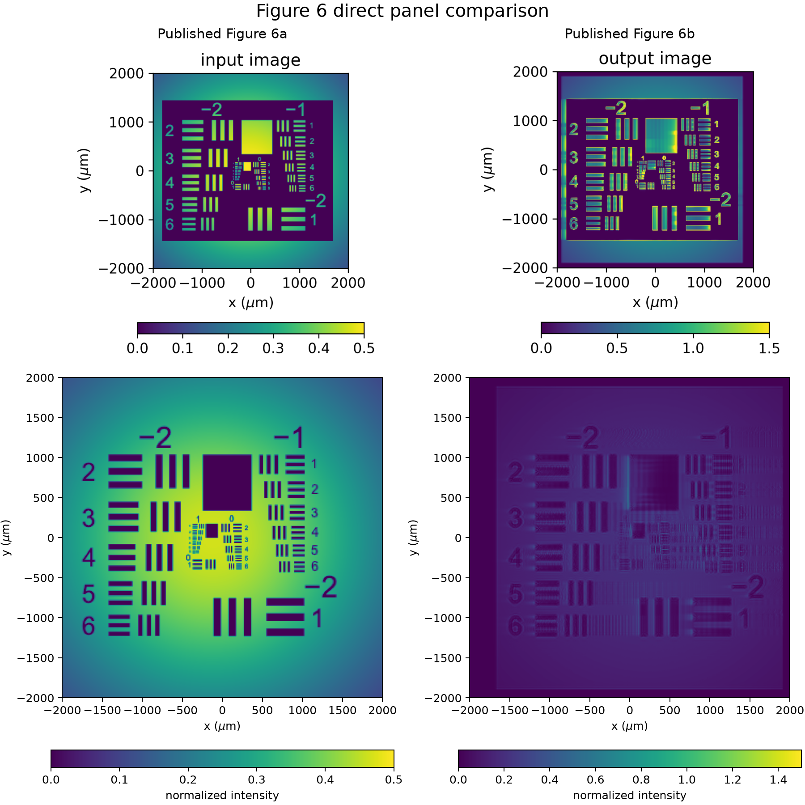
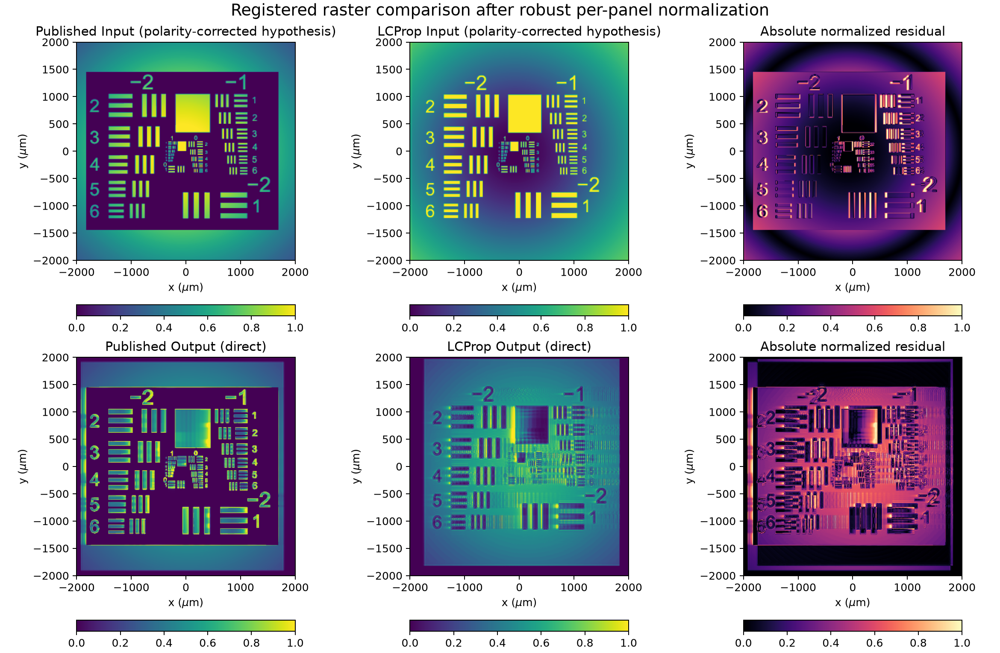

# PR Figure 6 Direct Image-Panel Comparison

**Date:** 2026-08-07

**Branch:** `feature/pr-second-order-static`

**Figure 6 run Git SHA:** `eab1959d53f9f03ff37d89cf0da7d7b6478db12d`

**Figure 6 run:** Slurm job `2227722`
**Classification:** Operational comparison complete; exact image reproduction not supported by the current run

> **Correction implemented locally.** The benchmark request now uses the
> published inverted Air Force transparency. The corrected launch comparison
> and its validation record are in
> `pr_figure6_request_correction_2026-08-07.md`. This document remains the
> diagnosis of job `2227722`; its output metrics continue to describe the
> superseded non-inverted request.

## Objective

This review compares the input and output panels from LCProp's Figure 6
calculation directly with published Figure 6a and 6b. It determines the
published observable, normalization, crop, plotting limits, orientation, and
image preprocessing from the paper, the rendered panels, and the trusted
`PRProp3D` implementation.

No propagation was rerun, no physical parameter was changed, and no production
solver code was modified. The comparison uses the preserved output of job
`2227722` and stops before any full-nonlinear Lie or production-Strang study.

## Sources

- Published panels:
  `reference/prprop/photonics-12-00113-v3/Fig 6-a.png` and
  `reference/prprop/photonics-12-00113-v3/Fig 6-b.png`.
- Published paper:
  `reference/prprop/photonics-12-00113-v3/photonics-12-00113-v3.pdf`.
- Trusted implementation: `reference/prprop/prprop3d.py`.
- [Paper supplementary archive](https://mdpi-res.com/d_attachment/photonics/photonics-12-00113/article_deploy/photonics-12-00113-s001.zip),
  downloaded for this review only; SHA-256
  `dac8abb1d8062e57b58c97b8e3849248d5b51720c5feb724029890e0653a343e`.
- Existing LCProp record:
  `docs/research/pr_figure6_paper_reproduction_2026-08-06.md`.
- LCProp normalized image products from job `2227722`.

The compact [comparison metrics](assets/pr_figure6_panel_comparison_2026-08-07/metrics.json)
record the source checksums, publication-pixel crops, registration, metrics,
and limitations.

## Published Observable

The published output is **carrier-isolated signal intensity**, not total
coherent intensity and not a back-propagated reconstruction.

The trusted code establishes the path unambiguously:

1. The coherent field is Fourier transformed.
2. `mask1` partitions the Fourier plane according to which of the two known
   carrier wavevectors is nearest.
3. `ampm = ifft2(ampft * mask1)` reconstructs the monitored, negative-frequency
   beam-1 carrier.
4. The input panel is `abs(amp0m) ** 2`; the output panel is
   `abs(ampm) ** 2`.
5. `backpropagate` would substitute a separately back-propagated carrier, but
   it was not used in the published panel.

The total coherent output, `abs(amp) ** 2`, contains the two-beam interference
grating and is not what `plot_data1()` displays.

## Intensity Normalization and Color Scale

PRProp3D normalizes the sum of the two input Gaussian peak intensities to one.
For beam ratio (r=1), its launch coefficients are

\[
a_1=\sqrt{\frac{1}{1+r}}=\frac{1}{\sqrt{2}},\qquad
a_2=\sqrt{\frac{r}{1+r}}=\frac{1}{\sqrt{2}}.
\]

An unobstructed isolated input carrier therefore has normalized peak intensity
(1/2). The Figure 6a color bar is linear from `0.0` to `0.5`, exactly matching
that convention.

The published Figure 6b color bar is linear from `0.0` to `1.5`. Both panels
use `viridis` with zero lower limit. These are absolute normalized-intensity
limits, not independent normalization of each panel to its maximum. The limits
were selected through PRProp3D's interactive input/output display controls;
the final slider values are visible in the published color bars but are not
stored in the supplementary parameter JSON.

The LCProp PNG products preserved from job `2227722` were independently divided
by their own maxima and quantized to eight bits. Consequently:

- the LCProp input can be mapped back to the known `0.5` peak convention;
- the LCProp output PNG cannot recover its original absolute maximum;
- this review can test normalized spatial structure, but not absolute
  pixel-by-pixel agreement with the published `0` to `1.5` output scale.

The lower-right panel below is therefore explicitly display-normalized to the
published limit. It must not be interpreted as an absolute-scale validation.

## Crop, Axes, and Orientation

The published field of view is the complete (4\times4\) mm computational
aperture:

\[
-2000\ \mu\mathrm{m}\le x\le 2000\ \mu\mathrm{m},\qquad
-2000\ \mu\mathrm{m}\le y\le 2000\ \mu\mathrm{m}.
\]

In PRProp3D, the image sample width and height are
`min(2*w01s, aperture)`. For the 3.4 mm waists, both exceed the 4 mm
aperture, so the aperture itself determines the crop. The trusted display then
applies `np.rot90(..., k=3)` to convert its stored array convention into the
published panel orientation.

The persisted LCProp PNG uses its native `(x, y)` raster convention. A
horizontal reflection maps its chart labels to the published presentation.
The comparison uses that presentation transform only; it does not modify any
field or solver result.

## Image Preprocessing

The trusted implementation performs the following preprocessing:

1. Load the image with Pillow.
2. Average color channels if the input is color.
3. Optionally invert the grayscale image.
4. Pad a non-square image to a square using its maximum value.
5. Rotate the square image with `np.rot90`.
6. Resize with nearest-neighbor interpolation (`order=0`).
7. Normalize the intensity transparency to a maximum of one.
8. Multiply the selected beam amplitude by the square root of that intensity
   transparency.

The Air Force chart used by job `2227722` is byte-identical to PRProp3D's
current authoritative chart: SHA-256
`e424f1070587d79d2a91f4a3bd14e7c11e80adfe7c723e45432d9d4fc5bb85b7`.

However, the **intensity polarity is different**. Published Figure 6a has a
dark chart field with bright bars and labels, surrounded by the unobstructed
Gaussian beam. Job `2227722` launched the opposite: a bright chart field with
dark bars and labels. This is not a colormap artifact; it is visible before
propagation and produces a direct normalized input correlation of `-0.602`.

The published panel is consistent with enabling PRProp3D's `invert image`
control. A display-level polarity correction changes the input correlation to
`+0.602`, but that operation is presented only as diagnostic evidence. It
cannot correct the already propagated nonlinear output.

## Supplementary-File Limitation

The paper's supplementary `Figure_3_4_6.json` does not preserve the final
Figure 6 request or display state. It contains `image_on_beam: "No Image"`,
`std_image: "MNIST 0"`, `image_invert: false`, a 3 by 1 mm aperture, 0.5 µm
wavelength, 600 µm waists, volume noise, and `gl=10`. Those values are the
earlier fanning/kinky-beam configuration already rejected during the Figure 6
setup audit.

Therefore, the paper caption and rendered Figure 6 panels remain authoritative
for the final geometry and presentation. The exact interactive notebook state
that produced the figure is not recoverable from the supplied JSON. The image
polarity can be inferred strongly from Figure 6a, but it cannot be independently
confirmed from a serialized final request.

## Direct Panel Comparison

The top row preserves the published panels. The lower row presents the LCProp
carrier-isolated products with the same physical field of view, orientation,
linear `viridis` presentation, and published color-bar endpoints. The lower
output panel uses display normalization because its PNG does not preserve the
absolute field maximum.

This comparison makes the input-polarity mismatch immediately visible. It also
shows that both outputs contain edge enhancement, but not the same detailed
image transformation.

## Registered Normalized Comparison

The published data regions were recovered from their eight-bit `viridis`
rasters by nearest lookup in a 4096-entry color-map table. The input crop is
publication pixels `[95:734, 282:921]`; the output crop is
`[89:728, 282:921]`. Each extracted panel and LCProp PNG was robustly mapped to
`[0,1]` using its 0.5th and 99.5th percentiles.

Registration was intentionally bounded to small publication-pixel shifts. The
input comparison uses a 6-pixel horizontal shift. The output optimum reached
the edge of the allowed 12-pixel search, so the output registration is not
considered a stable physical alignment.

The input row displays the polarity-corrected **presentation hypothesis**, not
a corrected simulation. The output row is direct; no polarity correction is
applied.

## Quantitative Results

| Comparison | Pearson correlation | Normalized RMSE | Edge correlation |
|---|---:|---:|---:|
| Input, direct | `-0.6019` | `0.5699` | `0.4649` |
| Input, display polarity corrected | `0.6019` | `0.2947` | `0.4649` |
| Output, direct | `0.0673` | `0.3651` | `0.1242` |

These are raster-level structural metrics, not field-level validation metrics.
They include publication antialiasing, color quantization, LCProp PNG
quantization, and bounded registration. The output values are additionally
confounded by the nonidentical input transparency. Difference images are
therefore meaningful as mismatch maps but not as numerical solver error.

## Interpretation

The direct review changes the scientific interpretation of job `2227722`:

- It remains a successful full-grid GPU execution, deterministic replay, and
  qualitative demonstration of large-signal edge enhancement.
- Its signal gain and operational evidence remain valid for the request that
  was actually run.
- It is **not an exact reproduction of published Figure 6**, because its input
  image transparency has the opposite polarity.
- The low direct output correlation cannot be assigned to the PR equation,
  optical splitting, or numerical implementation: the simulations did not
  start from the same image-bearing field.
- Absolute output-panel agreement also remains untested because the compact
  raw arrays were not available locally during this review and the preserved
  LCProp PNG discarded its maximum.

Likely residual sources after correcting the request would include the exact
interactive image-placement state, version differences between the paper's
notebook and the preserved `prprop3d.py`, publication rasterization, and only
then physical or numerical differences.

## Conclusion

The published Figure 6 presentation is now identified precisely enough for a
controlled rerun: carrier-isolated beam-1 intensity, full 4 mm square aperture,
linear `viridis`, input limits `0` to `0.5`, output limits `0` to `1.5`, and the
legacy panel orientation. The trusted code also supplies the exact filtering,
cropping, and image-resampling operations.

The present LCProp output cannot be accepted as a direct panel reproduction.
The decisive issue is not plotting or normalization but the opposite input
transparency polarity. A future corrected reference run should preserve raw
input and output carrier intensities, record their absolute extrema, and use
the published presentation without per-panel normalization. That rerun should
be reviewed before beginning the full-nonlinear Lie or production-Strang
comparison.

---

End of research record.
