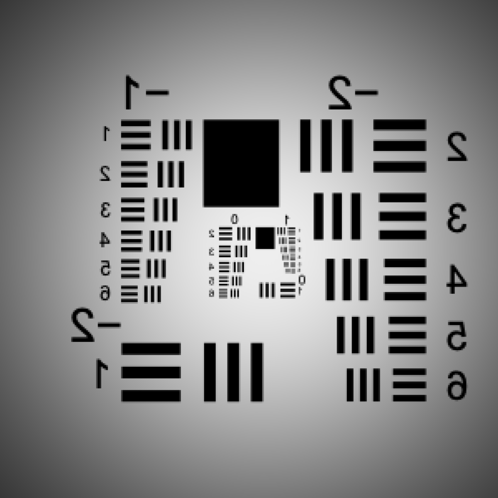
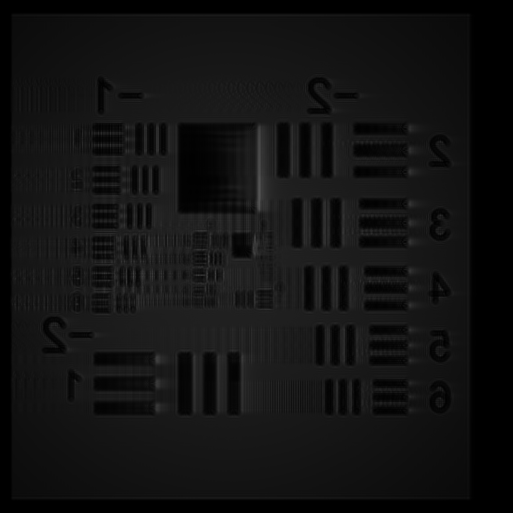
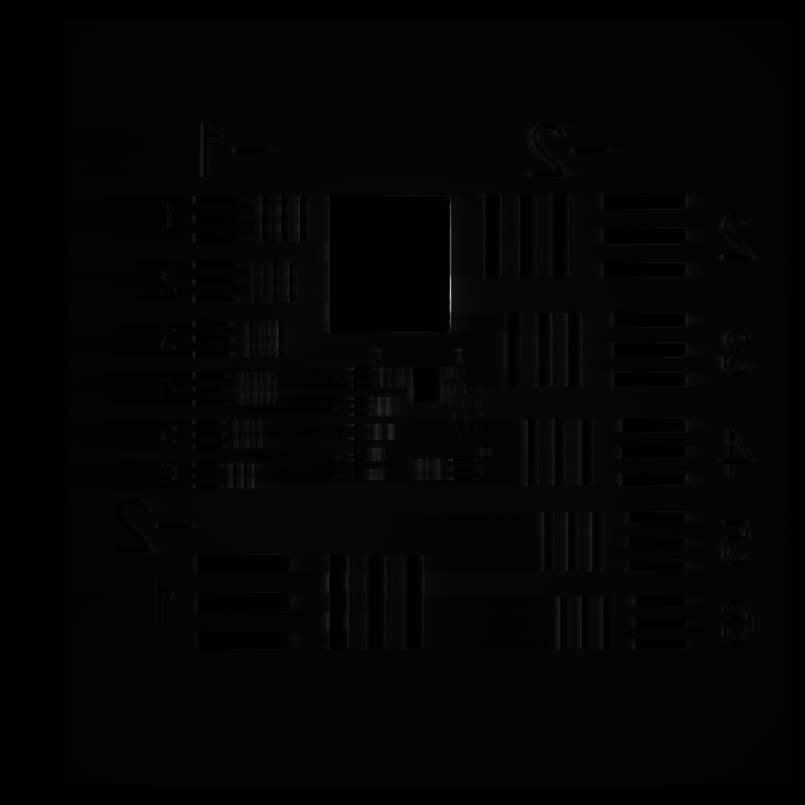
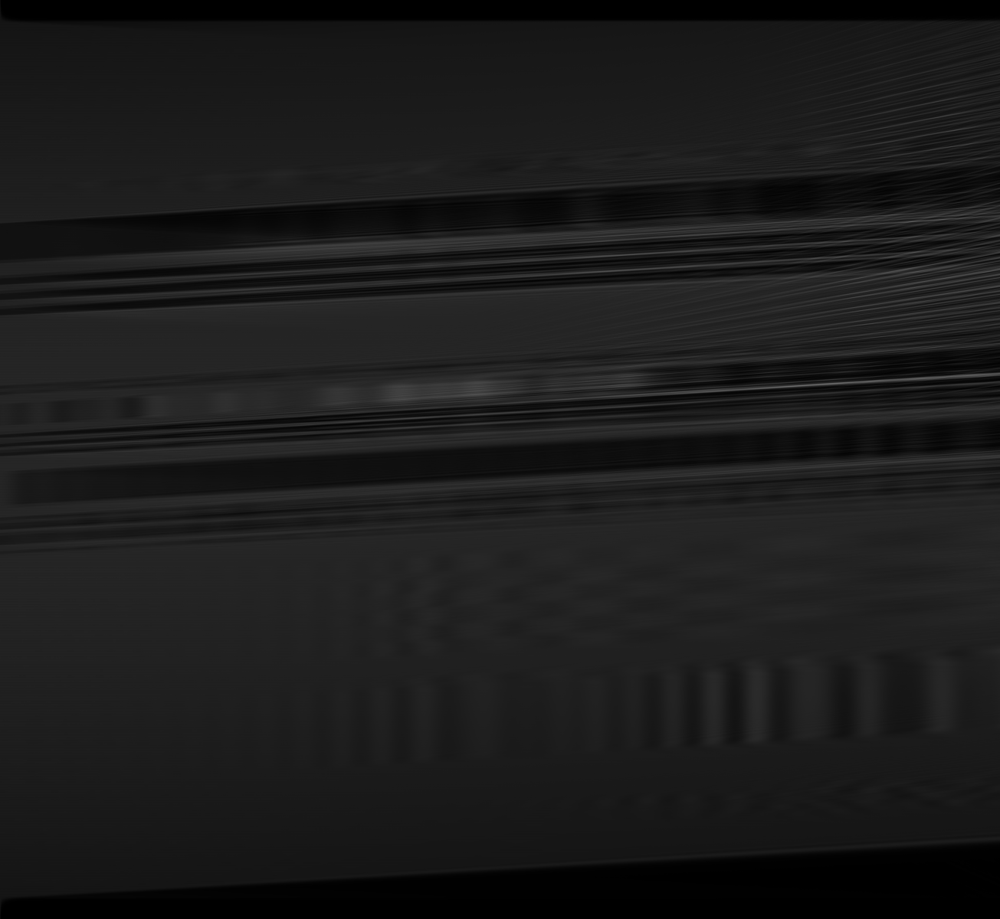

# PR Figure 6 Paper-Setup Reproduction

> **Superseded as an exact Figure 6 image reproduction.** Job `2227722` used
> the correct paper geometry but the opposite Air Force transparency polarity.
> Its operational, gain, replay, and performance results remain valid for the
> request actually run. The discrepancy is diagnosed in
> `pr_figure6_panel_comparison_2026-08-07.md` and corrected locally in
> `pr_figure6_request_correction_2026-08-07.md`.

**Date:** 2026-08-06

**Branch:** `feature/pr-second-order-static`

**Git SHA:** `eab1959d53f9f03ff37d89cf0da7d7b6478db12d`

**Slurm job:** `2227722`
**Classification:** Operational pass; successful qualitative large-signal edge-enhancement reproduction

## Milestone Summary

- Reconstructed the Figure 6 request directly from the published caption and
  the shared Figure 3/4/6 image-amplification configuration.
- Rejected the previously supplied 3 × 1 mm, 0.5 µm, 600 µm-waist, `gl=10`,
  noisy JSON as a Figure 6 source because it describes a fanning/kinky-beam
  regime.
- Completed the full 16,384 × 2,048 × 2,175 calculation and independent replay
  on an NVIDIA A100 80GB.
- Measured an absolute signal gain of `1.93549`, close to the equal-power
  coupled-wave prediction `1.99950`.
- Recovered the Air Force chart with the pronounced edge enhancement expected
  for the paper's pump-depleted, equal-input-power case.

## Authoritative Setup

The source is the Figure 6 caption in Cronin-Golomb, *Three-Dimensional
Scalar Time-Dependent Photorefractive Beam Propagation Model*, Photonics 2025,
12(2), 113. The caption identifies Figure 6 as the large-signal image-
amplification calculation with saturated gain 4000 and beam ratio 1. It uses
the same geometry as Figure 4. [Source paper](https://www.mdpi.com/2304-6732/12/2/113).

| Parameter | Published Figure 6 value |
|---|---:|
| Saturated intensity gain, `G_sat` | 4,000 |
| Beam intensity ratio | 1 |
| Grid | 16,384 × 2,048 × 2,175 |
| Transverse aperture | 4 × 4 mm |
| Interaction length | 4.35 mm |
| Longitudinal step | 2 µm |
| Wavelength | 0.514 µm |
| Beam waists | 3.4 mm |
| External input angles | ±7.56° |
| Dark intensity | 0.01 |
| Tukey alpha | 0.05 |
| Volume noise | None specified; disabled |

The Air Force chart was supplied explicitly as directed for this LCProp
reproduction.

## Gain and Angle Mapping

LCProp uses the paper convention

\[
G_{\mathrm{sat}}=\exp(2\gamma_pL).
\]

Thus

\[
\gamma_pL=\frac{1}{2}\ln(4000)=4.14702482005.
\]

The external 7.56° angle maps to grid-commensurate Fourier mode 1024 and an
internal half-angle of 3.14291°. With normalized signed grating wavevector
`-0.751126`, LCProp derives

\[
\gamma L=-4.31151372731.
\]

The negative `gl` is the image-amplifying sign for the selected signal-carrier
ordering. It is not an arbitrary sign reversal. For equal input powers, the
finite-ratio analytic signal gain is `1.99950012497`, approaching the maximum
factor of two set by pump depletion.

## Numerical Method

The calculation used the explicitly named
`legacy_linearized_spectral_lie` reference path:

- spectral solution of the trusted linearized static PR equation;
- full angular-spectrum diffraction followed by a full material screen;
- trusted Tukey apodization;
- bounded-memory longitudinal streaming;
- no volume noise;
- independent deterministic replay from the original launch and zero material
  seed.

This is the paper/trusted-code reference path. It is distinct from LCProp's
full-nonlinear production Strang workflow.

## Reproduction Manifest

| Item | Value |
|---|---|
| Checkout | `/cluster/tufts/cglab/mcroning/LCProp` |
| Git SHA | `eab1959d53f9f03ff37d89cf0da7d7b6478db12d` |
| Repository state | Clean detached checkout |
| Python | `/cluster/tufts/cglab/mcroning/condaenv/prenv/bin/python` |
| LCProp import | `/cluster/tufts/cglab/mcroning/LCProp/src/lcprop/__init__.py` |
| Payload | `/cluster/tufts/cglab/mcroning/lcprop_runs/pr_figure6_paper_setup.py` |
| Payload SHA-256 | `d90a61b6baaea6062e53693fe85f5ee86ee250397436a74e5f9475bdbb4c8e26` |
| Slurm script | `/cluster/tufts/cglab/mcroning/lcprop_runs/lcprop_pr_figure6_paper_setup.sbatch` |
| Slurm-script SHA-256 | `97d33f5df5f19fb5000123874f4da3f83617fb83b39841905b0da8639e81c2c5` |
| Air Force chart SHA-256 | `e424f1070587d79d2a91f4a3bd14e7c11e80adfe7c723e45432d9d4fc5bb85b7` |
| Remote run directory | `/cluster/tufts/cglab/mcroning/lcprop_runs/pr-figure6-paper-2227722` |
| Local retrieval directory | `/private/tmp/lcprop-pr-figure6-paper-2227722` |

Compact [metrics](assets/pr_figure6_paper_reproduction_2026-08-06/metrics.json)
and [provenance](assets/pr_figure6_paper_reproduction_2026-08-06/provenance.txt)
are preserved with this report.

The 251,920,066-byte `compact_diagnostics.npz` archive remains in the remote
run directory. It is intentionally excluded from Git. Its SHA-256 is
`57ee65af9e4d95113808f38688d1d6e7dd4ec5d99d083ed571d7c0f9b46b0146`.

## Operational Results

| Diagnostic | Result |
|---|---:|
| Slurm state | `COMPLETED` |
| Exit code | `0:0` |
| Node | `pax007` |
| GPU | NVIDIA A100 80GB PCIe |
| Backend | CuPy float64; no fallback |
| Completed slices | 2,175 of 2,175 |
| Workflow status | `converged` |
| Replay field maximum difference | 0.0 |
| Replay diagnostic-moment differences | 0.0 |
| stderr | Empty |

The `converged` status applies to the selected linearized spectral reference
equation. The complete nonlinear hopping-model residual was recorded
separately and was not used to declare legacy-reference convergence.

## Scientific Results

| Metric | Measured | Reference |
|---|---:|---:|
| Absolute signal gain | `1.9354864071712272` | `1.9995001249687578` |
| Difference from analytic gain | −3.20% | — |
| Image-intensity correlation | `0.37610315715804943` | Qualitative edge-enhancement case |
| Normalized image RMSE | `0.8388530506322817` | Qualitative edge-enhancement case |
| Initial normalized power | `1.0000000000000009` | — |
| Final normalized power | `0.8921907193475475` | — |
| Relative power change | `-0.10780928065245333` | Tukey-apodized calculation |

The 10.78% power reduction is expected to include repeated Tukey-window loss;
this reference path is not a unitary phase-only propagation test. Separate
no-apodization commissioning tests established phase-only power conservation.

The correlation and RMSE are not acceptance criteria for Figure 6. Unlike the
small-signal Figure 4 case, Figure 6 deliberately demonstrates pump-depletion
edge enhancement, which redistributes spatial contrast and lowers whole-image
correlation even when the target remains recognizable.

## Figures

### Image-bearing input

### Total coherent output

The Air Force chart remains recognizable and displays pronounced enhancement
of boundaries and fine bar features, qualitatively matching the behavior
described in the Figure 6 caption.

### Carrier-isolated output and back-propagated reconstruction

| Isolated signal carrier | Back-propagated reconstruction |
|---|---|
|  |  |

All transverse panels use the physical square 4 × 4 mm aperture rather than
the 8:1 raw sample-count aspect ratio.

### Center-plane histories

| Space-charge field `E(x,z)` | PR-driving intensity `I(x,z)` |
|---|---|
|  |  |

The `x-z` renderings use the physical 4.35:4.00 longitudinal-to-transverse
aspect ratio.

## Performance

| Measurement | Result |
|---|---:|
| Slurm elapsed time | 971 seconds |
| Synchronized calculation | 945.0483117075637 seconds |
| Total payload | 963.0934543386102 seconds |
| Cold CuPy initialization | 0.4669523099437356 seconds |
| Batch MaxRSS | 9,146,324 KiB |
| CuPy pool capacity after run | 16,643,720,704 bytes |
| CuPy pool used after run | 1,073,741,824 bytes |
| Remote result size | 242 MiB |

The CuPy pool capacity is an allocator measure rather than a continuously
sampled GPU high-water mark. The run remained well within the A100 80GB and
64 GiB host-memory allocations.

## Disposition of Earlier Runs

Jobs `2227322` and `2227502` used the supplied fanning-derived JSON geometry.
They are retained as useful full-scale streaming and noise controls, but they
are not Figure 6 reproduction attempts. Pending sign-test job `2227574` was
canceled before execution when the configuration error was recognized.

## Conclusion

The paper-derived Figure 6 calculation is an operational and qualitative
scientific success. LCProp completed and replayed the full published grid,
produced signal transfer within 3.20% of the equal-power coupled-wave limit,
and generated the expected Air Force-chart edge enhancement.

This result also resolves the earlier missing-image problem: it arose from
using a fanning/kinky-beam parameter set, not from GPU execution or volume
noise. The correct image-amplification geometry automatically derives the
appropriate negative `gl` for the selected carrier ordering from
`G_sat=4000`.

## Recommended Next Step

Perform a direct image-panel comparison against the published Figure 6 or its
trusted PRProp3D array, using the same intensity normalization and crop. After
that reference presentation is matched, run the full-nonlinear Lie and
production-Strang paths on the same paper-derived request to isolate material-
equation and optical-ordering differences.

---

End of research record.
