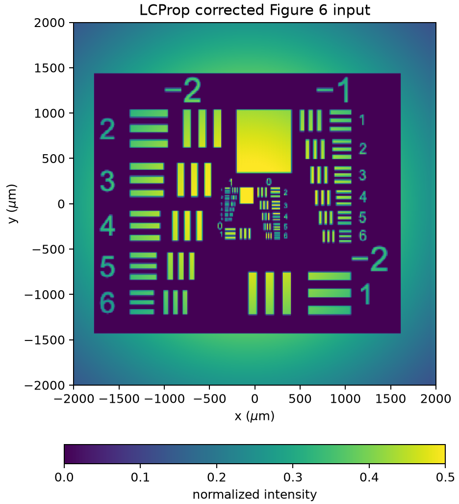
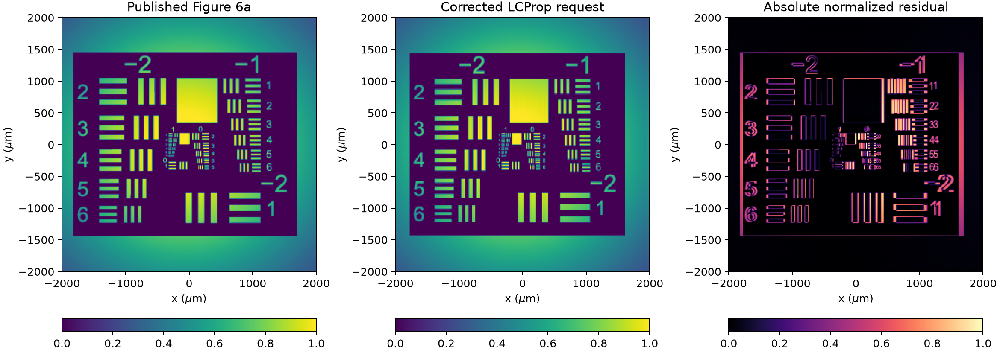

# PR Figure 6 Request-Correction Milestone

**Date:** 2026-08-07

**Branch:** `feature/pr-second-order-static`

**Base Git SHA:** `eab1959d53f9f03ff37d89cf0da7d7b6478db12d`
**Classification:** Local implementation and validation passed; ready for pre-commit review

## Milestone Summary

- Corrected the public Figure 6 benchmark contract from the mislabeled
  supplementary saved run to the geometry and physics reported in the paper.
- Set the benchmark's Air Force transparency to the published polarity: dark
  chart field, bright bars and labels, and transparent exterior.
- Preserved the image-preprocessing implementation, carrier filter, optical
  propagation, PR solvers, production defaults, and numerical algorithms.
- Added a deterministic local launch-panel comparison against published Figure
  6a and retained the previous non-inverted launch as a negative control.
- Improved normalized launch-panel correlation from a negative control value
  of `-0.27635` to `+0.79876`.
- Did not propagate the corrected paper-scale request or evaluate Figure 6b.

## Background and Root Cause

The direct panel audit in
`pr_figure6_panel_comparison_2026-08-07.md` found that job `2227722` used the
correct Air Force image file but launched the opposite transparency polarity
from published Figure 6a.

The source of the error was the benchmark specification, not the general image
preprocessor. `paper_figure6_spec()` encoded the paper supplement's file named
`Figure_3_4_6.json`. That file is not the final Figure 6 request: it selects no
image and contains the earlier noisy 3 mm by 1 mm, 0.5 µm, 600 µm-waist,
`gl=10` configuration. The full-scale caption-derived payload later worked
around most of that error by constructing Figure 6 from `paper_figure4_spec()`,
but it inherited `invert_image=False`.

The production dataclass default was already `invert_image=True`. No production
default or preprocessing function required modification.

## Corrected Published Contract

`paper_figure6_spec()` now records:

| Parameter | Corrected value |
|---|---:|
| Grid | 16,384 × 2,048 × 2,175 |
| Aperture | 4,000 µm × 4,000 µm |
| Interaction length | 4,350 µm |
| Longitudinal step | 2 µm |
| Wavelength | 0.514 µm |
| Refractive index | 2.4 |
| External half-angles | ±7.56° |
| Periodic carrier mode | 1,024 |
| Grating samples per period | 8 |
| Beam waists | 3,400 µm |
| Input peak-intensity ratio | 1 |
| Saturated small-signal gain | 4,000 |
| Derived gain-length product | −4.31151372731 |
| Dark intensity | 0.01 |
| Tukey alpha | 0.05 |
| Scattering noise | Disabled |
| Air Force transparency | Inverted |

The `Nt` and `dt_normalized` members remain compatibility fields of the common
image-amplification spec. The static streaming workflow does not consume them,
and they are not asserted as published Figure 6 physics.

The historical 1,970-seed sequence remains in
`src/lcprop/pr/figure6_noise_seeds.py` for future fanning/reference work. The
corrected Figure 6 spec does not select it.

## Exact Preprocessing Path

The corrected benchmark uses the existing implementation without adding a
second conversion:

1. Convert the checksummed source through Pillow grayscale conversion.
2. Normalize source intensity to `[0,1]`.
3. Invert the source intensity.
4. Pad the non-square source to an even square with transparent value one.
5. Rotate the square into LCProp's `(x,y)` array convention.
6. Resize with nearest-neighbor interpolation and no prefilter.
7. Center the transparency on the image-bearing signal at launch.
8. Multiply the signal amplitude by the square root of the intensity
   transparency.
9. Restore the requested signal-to-pump peak ratio and normalize total launch
   power.
10. Isolate the displayed signal with the unchanged nearest-carrier Fourier
    mask.
11. Transpose and reflect the persisted raster into the published panel
    orientation.

Inversion occurs before square padding. This ordering is essential: the chart
interior is inverted while the padded exterior remains transparent.

## Local Launch Validation

The local check uses `scripts/checks/pr_figure6_request_correction.py` with:

- Air Force chart SHA-256
  `e424f1070587d79d2a91f4a3bd14e7c11e80adfe7c723e45432d9d4fc5bb85b7`;
- published Figure 6a SHA-256
  `14a36afa232a06cdeab16b7b009ab4c7c2ac83848af83e09979b9a9f945fb5dc`;
- published data crop `[95:734, 282:921]`;
- inverse lookup through a 4,096-entry `viridis` table;
- the published full-aperture axes and linear `0` to `0.5` intensity scale.

To keep the validation bounded on CPU, all transverse and longitudinal
lengths, wavelength, carrier index, and sample counts are scaled by 0.25. This
similarity mapping preserves the external angle, eight samples per grating
period, waist-to-aperture ratio, interaction-length-to-aperture ratio, and
image-size-to-waist ratio. It validates the launch contract and presentation;
it is not a propagated Figure 6 reproduction.

The non-inverted control differs from the corrected request only in
`invert_image`. Grid, material, solver controls, carrier filtering, and launch
construction are identical.

## Corrected Input Products

### Published-scale corrected panel



### Registered comparison



Compact machine-readable provenance and metrics are preserved in
[metrics.json](assets/pr_figure6_request_correction_2026-08-07/metrics.json).

## Quantitative Results

| Launch request | Correlation | Normalized RMSE | Edge correlation | Horizontal registration |
|---|---:|---:|---:|---:|
| Corrected inverted request | `0.7987636` | `0.1954290` | `0.4145614` | −8 publication pixels |
| Previous non-inverted control | `-0.2763542` | `0.5228336` | `0.1841940` | +24 publication pixels |

The non-inverted registration reaches the positive edge of the bounded search,
which is further evidence that it is not the same presentation. The corrected
request exceeds the predeclared `0.75` correlation threshold and visually
matches the published intensity polarity, chart placement, transparent
exterior, axes, and color limit.

The residual contains small feature-edge differences from publication
rasterization, the quarter-scale validation grid, bounded integer registration,
and possible notebook-version differences. It is not interpreted as optical or
material solver error because no propagation occurs in this validation.

## Regression Validation

Commands executed from the repository root with the `lcprop` environment:

```text
PYTHONPATH=src .../envs/lcprop/bin/python -m pytest -q \
  tests/test_pr_image_amplification.py tests/test_pr_static_streaming.py
```

Result: `24 passed, 1 skipped`. The skipped test is the prepared CuPy test on a
machine without CuPy.

```text
PYTHONPATH=src .../envs/lcprop/bin/python -m pytest -q tests/test_pr*.py \
  --junitxml=/private/tmp/pr_figure6_request_correction_full.xml
```

Result: `170 tests`, `0 failures`, `0 errors`, `6 skipped` in 33.517 seconds.
All skips are optional CuPy/GPU paths unavailable in the local environment.

```text
PYTHONPATH=src .../envs/lcprop/bin/python -m py_compile \
  scripts/checks/pr_figure6_request_correction.py \
  scripts/checks/pr_figure6_streaming_reference.py
```

Result: passed.

`ruff` was not available in the `lcprop` environment; no package installation
or environment change was made. `git diff --check` is part of the final review
below.

## Scope and Unchanged Behavior

No changes were made to:

- optical launch equations;
- carrier-mask construction;
- angular-spectrum propagation;
- PR material equations;
- static, transient, legacy-Lie, full-nonlinear-Lie, or production-Strang
  solvers;
- production solver defaults;
- persistence, execution, GUI, or LC code.

The benchmark contract and its validation script are the only executable
behavior changes. Existing scaled image-amplification, streaming, replay,
precision, persistence, and PR workflow tests pass unchanged.

## Output-Panel Gate

Figure 6b was not reevaluated. The old output belongs to the non-inverted
request and cannot be corrected by post-processing. A new output comparison
requires a corrected full-scale propagation, which is outside this local
milestone and requires a separate cluster-preparation and submission gate.

No full-nonlinear Lie or production-Strang comparison has begun.

## Pre-Commit Assessment

### Architectural assessment

The change remains PR benchmark-owned. It corrects a named research spec and
does not introduce benchmark assumptions into generic optics or production
workflows.

### Implementation assessment

The correction uses the existing `invert_image` field and existing
preprocessing path. There is no duplicate inversion, plotting-only fix, public
API addition, or numerical-algorithm change. Historical noise seeds are
preserved but no longer mislabeled as published Figure 6 inputs.

### Validation assessment

The request contract, preprocessing order, polarity control, panel comparison,
focused tests, and complete PR suite all pass. The output panel remains
deliberately unevaluated until a corrected propagation is separately approved.

### Blocking defects

None found.

### Nonblocking recommendations

- Preserve absolute carrier-intensity extrema and raw input/output carrier
  arrays in the future corrected full-scale run.
- Use the published `0` to `0.5` and `0` to `1.5` limits without independent
  PNG normalization.
- Keep Figure 6 output review separate from later nonlinear-Lie and
  production-Strang comparisons.

### Classification

**Ready for independent pre-commit review.** The next lifecycle gate is
`Approve review`; commit, push, and cluster work remain unauthorized.

---

End of research record.
