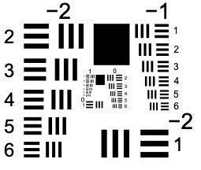
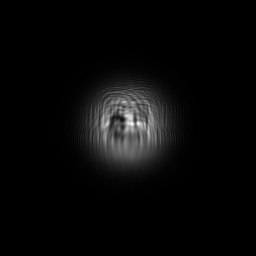
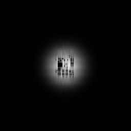
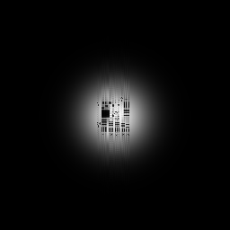

# GPU Image-Amplification Pilot Report

**Lab notebook entry:** 1

**Date:** 2026-08-05

**Branch:** `feature/pr-second-order-static`

**Run status:** Passed

## Milestone Summary

- First successful end-to-end PR image-amplification calculation performed with LCProp.
- First research calculation to exercise LCProp's material-composition architecture by combining a PR-owned material package with the shared beam launch, runtime grid, backend, and prepared optical-response interfaces.
- First GPU research calculation using the production second-order semi-implicit PR integrator.
- Performed after CPU/CuPy commissioning established optical- and PR-field agreement at relative differences of approximately 1.54 × 10⁻¹⁵ and 2.03 × 10⁻¹⁵, respectively.
- Successfully executed on an NVIDIA L40S under Slurm with checksummed inputs and detailed run provenance.
- Established the baseline for the material-time approach-to-steady-state study.

## Objective

This pilot was the first bounded, research-oriented photorefractive (PR) image-amplification calculation run by LCProp on a scheduler-assigned GPU. Its purpose was to establish that the new PR workflow could execute a finite coherent image-bearing signal and pump calculation through the shared optical propagation engine using CuPy, produce measurable signal amplification, reconstruct the encoded image, conserve optical power, and capture sufficient provenance for later reproduction.

It was also the first successful PR image-amplification calculation performed with LCProp. Architecturally, it exercised the material-composition design by combining the shared beam launch, runtime grid, backend abstraction, and optical propagation engine with an independent PR material package, without routing PR physics through the LC workflows. LCProp's checkpoint persistence codec and generic worker dispatch were not exercised by this run.

The run was deliberately smaller than the paper-scale benchmark. It was a commissioning and scientific-readiness calculation, not a claim of quantitative agreement with the ideal plane-wave limit or a completed image-amplification validation study.

## Software and Reproduction Identity

| Item | Recorded value |
|---|---|
| Git checkout | `ea22bf574f5375750ee5f3ec9e8a1c218abdd093` |
| Repository | `/cluster/tufts/cglab/mcroning/LCProp` |
| Pilot driver | `scripts/checks/pr_image_amplification_gpu_pilot.py` |
| Slurm script | `/cluster/tufts/cglab/mcroning/lcprop_runs/lcprop_pr_image_pilot.sbatch` |
| Slurm script SHA-256 | `3475cac23257acc11c59db5eeec66dfa0756eb7480cc737aeca3ee17b11e089d` |
| Input image | `/cluster/tufts/cglab/mcroning/lcprop_runs/inputs/AF_Res_Chart.png` |
| Input image SHA-256 | `e424f1070587d79d2a91f4a3bd14e7c11e80adfe7c723e45432d9d4fc5bb85b7` |
| Python executable | `/cluster/tufts/cglab/mcroning/condaenv/prenv/bin/python` |
| CUDA module | `cuda/12.9.0` |
| Persistent run directory | `/cluster/tufts/cglab/mcroning/lcprop_runs/image-pilot-2209653` |
| Compute-node scratch directory | `/tmp/lcprop-pr-image-pilot-2209653` |

The exact submission command was:

```bash
ssh -o BatchMode=yes mcroning@login.pax.tufts.edu \
  'sbatch --parsable /cluster/tufts/cglab/mcroning/lcprop_runs/lcprop_pr_image_pilot.sbatch'
```

Within the allocation, the scientific payload was:

```bash
/cluster/tufts/cglab/mcroning/condaenv/prenv/bin/python \
  scripts/checks/pr_image_amplification_gpu_pilot.py \
  --image /tmp/lcprop-pr-image-pilot-2209653/AF_Res_Chart.png \
  --output-dir /tmp/lcprop-pr-image-pilot-2209653/products \
  --output-json /tmp/lcprop-pr-image-pilot-2209653/metrics.json
```

The Slurm script verified both the Git SHA and input-image checksum before running the payload. The compact machine-readable [metrics record](assets/pr_gpu_image_amplification_pilot_2026-08-05/metrics.json) and [provenance record](assets/pr_gpu_image_amplification_pilot_2026-08-05/provenance.txt) are preserved with this report.

## Cluster Configuration

| Item | Value |
|---|---:|
| Slurm job ID | `2209653` |
| Scheduler result | `COMPLETED`, exit code `0:0` |
| Compute node | `pax020` |
| Partition / QOS / account | `gpu` / `normal` / `default` |
| Nodes / tasks | 1 / 1 |
| CPUs per task | 2 |
| Requested host memory | 16 GiB |
| Requested wall time | 30 minutes |
| Requested GPUs | 1 |
| Scheduler elapsed time | 45 seconds |
| GPU | NVIDIA L40S |
| CUDA-visible device | 0 |
| Scheduler GPU identifier | 3 |
| Compute capability | 8.9 |
| NVIDIA driver | 575.57.08 |
| CUDA driver API | 12.9 |
| CUDA runtime API | 12.9 |
| CuPy | 13.6.0 |
| Python | 3.10.4 |
| NumPy / SciPy | 2.1.0 / 1.15.2 |

LCProp was explicitly requested with the CuPy backend and reported `backend=cupy` and `is_gpu=true`. No NumPy fallback was accepted or observed. Loading `cuda/12.9.0` supplied the CUDA runtime libraries, including the required NVRTC library.

This calculation followed a separate CPU/CuPy commissioning smoke test, Slurm job `2209626`, at Git SHA `c0f5e068628e94c122a16dfc2bd4fcb459a2a9b7`. For an identical 32 × 32 × 4 request with two material steps, that test measured maximum relative NumPy/CuPy differences of 1.5446954885271889 × 10⁻¹⁵ in the optical field and 2.030929341994031 × 10⁻¹⁵ in the PR field. Those results established machine-precision backend agreement for the commissioning case before this larger pilot was attempted.

## Numerical Method

The calculation used LCProp's PR-owned time-dependent workflow with the normalized space-charge field `E(z,x,y)` as the material state. This was the first GPU research calculation using the production second-order `semi_implicit_trapezoidal` PR integrator in `float64`. The stiff intensity-weighted diffusion term was treated through the linearly implicit predictor/corrector, while the optical source was evaluated at the accepted and predicted material states.

For each optical replay, the workflow reconstructed the launch field and advanced it longitudinally through the frozen `E` state. The PR package converted each slice of `E` to a multiplicative complex half-step response and passed it to `advance_prepared_response()`. The optical pass therefore retained the material-neutral frozen-response Strang ordering rather than the legacy full-diffraction/full-response Lie ordering. The PR-driving intensity at a slice was the average of the values immediately before and after that slice's optical advance.

The coherent pump and image signal occupied grid-commensurate transverse Fourier carriers. Output signal power was measured by assigning Fourier components to the nearest of the known pump and signal carriers, not by spatially splitting the overlapping beams. Image fidelity was measured after isolating the signal carrier and linearly back-propagating it to the input plane. The same reconstruction applied to a zero-PR-response propagation provided the control.

Both the material and optical transverse grids were periodic. No apodization or scattering noise was included.

## Pilot Parameters

| Parameter | Value |
|---|---:|
| Transverse grid | 256 × 256 |
| Transverse aperture | 256 × 256 µm |
| Transverse spacing | 1 × 1 µm |
| Interaction length | 400 µm |
| Longitudinal spacing | 20 µm |
| Longitudinal steps | 20 |
| Wavelength | 0.633 µm |
| Refractive index | 2.4 |
| Beam waist | 48 µm |
| Samples per waist | 48 |
| Positive carrier mode | 8 |
| Samples per two-beam grating period | 16 |
| Signal-to-pump input peak ratio | 0.001 |
| Target saturated small-signal gain | 10 |
| Signal gain sign | +1 |
| Equivalent dark intensity | 0.05 |
| Characteristic wavenumber | 0.5 µm⁻¹ |
| Material steps, `Nt` | 200 |
| Normalized material timestep | 0.05 |
| Applied field | 0 |
| Image inversion | Disabled |
| Arithmetic | `float64` / `complex128` |

The source image was an Air Force resolution chart with an original shape of 216 × 255 pixels. It was normalized, padded, rotated into LCProp's `(x,y)` array convention, resized with nearest-neighbor sampling, and applied as a real intensity transmission to the signal beam.

## Figures

### Input target and launched signal

| Input target | Image-bearing input signal |
|---|---|
|  |  |

The signal is carried within the finite Gaussian beam envelope; regions outside the illuminated aperture are not expected to contribute equally to the reconstruction metric.

### Output and reconstructed signal

| Isolated signal at the output plane | Back-propagated signal reconstruction |
|---|---|
|  |  |

The output-plane signal contains propagation blur and carrier-related structure. After Fourier carrier isolation and back-propagation, the principal chart structure, central feature, and bar groups are recovered. Fine features are softened and the finite beam envelope limits fidelity near the edges.

### Zero-response reconstruction control



The zero-response reconstruction has an intensity correlation of exactly 1.0 with the input signal. Its PNG is byte-identical to `input_signal.png`, providing a direct control of carrier isolation, forward propagation, and back-propagation.

## Scientific Metrics

| Metric | Result | Pilot acceptance limit |
|---|---:|---:|
| Measured finite-image absolute signal gain | 4.51124753468667 | > 1.1 |
| Ideal plane-wave analytic gain | 9.910891089108912 | Reference only |
| Image-intensity correlation | 0.9897689452600813 | > 0.8 |
| Zero-response image-intensity correlation | 1.0 | Control |
| Normalized image RMSE | 0.18040825934966398 | < 1.0 |
| Relative total-power drift | −2.3314683517128287 × 10⁻¹⁵ | absolute value < 10⁻⁹ |
| Finite numerical outputs | Yes | Required |

The negative drift sign indicates a negligible decrease in total optical power; acceptance is based on the absolute drift.

The measured finite-image gain of 4.51125 and the ideal plane-wave analytic gain of 9.91089 are not expected to agree at this pilot stage. The analytic value describes the ideal coupled-wave limit. This calculation instead used finite Gaussian beams, an encoded spatial image, a finite periodic aperture, and a material state evolved for a finite normalized time. The analytic value is therefore a scale and sign reference, not an acceptance target for this run.

## Timing

| Measurement | Seconds |
|---|---:|
| Cold CuPy initialization | 0.8931998913176358 |
| Synchronized GPU execution | 36.55043317889795 |
| PR evolution including optical passes | 36.486970383673906 |
| Reconstruction optical propagation | 0.011398293543606997 |
| Complete reconstruction | 0.019370372872799635 |
| Benchmark calculation | 36.506350552197546 |
| Pilot script wall time | 37.5067474138923 |
| Slurm elapsed time | 45 |

The synchronized execution time includes the GPU work after cold CuPy initialization. Reconstruction was performed on host arrays and is separately reported. The earlier CPU preflight used only a 64 × 64 × 5 grid with two material steps, versus 256 × 256 × 20 with 200 material steps here, so it is not a valid CPU/GPU performance comparison. It nevertheless provided a useful pipeline control: both calculations were finite, amplified the signal, retained strong image correlation, and conserved power.

## Memory and Storage

| Measurement | Value |
|---|---:|
| GPU total memory visible to CuPy | 47,665,709,056 bytes |
| GPU free memory before run | 47,208,267,776 bytes |
| GPU free memory after run | 46,946,123,776 bytes |
| CuPy pool peak proxy | 259,014,144 bytes, approximately 247 MiB |
| CuPy pool used after run | 0 bytes |
| Slurm batch MaxRSS | 393,356 KiB |
| One `float64` `E(z,x,y)` state estimate | 10,485,760 bytes |
| Scratch result size | 579,048 bytes |
| Final persistent result size | 573,902 bytes |

The CuPy pool value is an allocator-pool peak proxy, not a continuously sampled hardware high-water mark. It nevertheless shows that this pilot used only a small fraction of the L40S memory capacity.

## Comparison with the CPU Preflight

The geometrically similar CPU preflight produced a measured gain of 1.1581647869609646, image correlation of 0.9958686941550648, normalized RMSE of 0.09973759766446827, and power drift of 4.440892098500626 × 10⁻¹⁶. Its much smaller grid and two material steps were selected only to validate request construction, image handling, metrics, output writing, and controlled failure behavior before scheduler submission.

The GPU pilot therefore should not be interpreted as slower or faster on the basis of these two runs. Its relevant comparison is behavioral: both backends produced finite, amplified, image-preserving, power-conserving results through the same workflow and initial-condition construction.

## Discussion

This run established the complete operational path from a version-identified checkout and checksummed source image through Slurm allocation, CUDA module setup, CuPy backend selection, PR material evolution, material-neutral optical propagation, image reconstruction, and durable result retrieval. The backend identity and scheduler-assigned GPU were verified directly; there was no silent fallback.

Scientifically, the pilot demonstrates substantial image-bearing signal amplification while preserving the dominant spatial information. The correlation of 0.98977 is strong, while the normalized RMSE of 0.18041 reflects changes in local contrast and finite-beam weighting that correlation alone does not capture. Total-power conservation at the 10⁻¹⁵ relative level confirms that the numerical optical propagator remained internally consistent throughout the calculation.

The gap between measured finite-image gain and the ideal plane-wave prediction remains intentionally unresolved by this commissioning run. Possible contributors include incomplete material-time convergence, finite Gaussian overlap, spatial modulation of the signal, and departure of the generalized hopping model from reduced coupled-wave behavior at finite modulation. These effects must be separated by controlled convergence studies rather than by changing several spatial and temporal parameters simultaneously.

No scheduler, CUDA, backend, numerical-finiteness, power-conservation, or pilot-threshold failure occurred. Standard error was empty. The only retrieval issue was a local SCP client quirk with recursive multi-source copying; explicit transfers retrieved every expected file and did not affect the remote calculation.

## Data Preservation

The following compact artifacts are committed with this report:

- `metrics.json`, SHA-256 `1f686ec06875b66d19b20c87b8108684b971ef9afbd35dde963c91979e3eb9b9`
- `provenance.txt`, SHA-256 `33af3f868c3cdd0e1c1e9b2f85ea2b3225ed8d6f1364085c124f1061415cb8c7`
- `input_target.png`, SHA-256 `effdc3569ffd9bcce2f7038b7ac46e49d2a400c2627cad5e03172021458c81cb`
- `input_signal.png`, SHA-256 `f3d888387c69fb430cbcf89abe3a199383e65b1772cb0eff2d64ee33917afcfd`
- `output_signal.png`, SHA-256 `3e437348c0d55256729eaa456bb7f08401771e9b412ba92bf4362e701161ee7c`
- `reconstructed_signal.png`, SHA-256 `0aa3fc2f588df8fb216ccbbbca8190ff5491c4560d076f3eb61f8f45a3b850b5`
- `zero_response_reconstruction.png`, SHA-256 `f3d888387c69fb430cbcf89abe3a199383e65b1772cb0eff2d64ee33917afcfd`

The following run products are intentionally omitted from Git to avoid storing redundant or larger binary arrays:

- `products/E_final_midplane.npy`, 262,272 bytes, SHA-256 `db3ff0fa338b0e82f30d4233ece889633c658522c38b1fbcdd30f85593cce7af`
- `products/reconstructed_signal_intensity.npy`, 262,272 bytes, SHA-256 `df029624e811f2cc8ba78006380393967d36b2d733429c0bd0d5dc9f0ee42748`
- scheduler stdout, which is byte-identical to the committed `metrics.json`
- empty scheduler stderr
- `exit_code.txt`, whose zero value is also recorded in provenance and metrics

The omitted numerical arrays and complete run directory remain in `/cluster/tufts/cglab/mcroning/lcprop_runs/image-pilot-2209653`. A retrieved working copy was also stored at `/private/tmp/lcprop-pr-image-pilot-2209653` when this report was prepared; that temporary local path is not a durable archive.

## Conclusion

The first successful PR image-amplification calculation performed with LCProp passed. It used a real scheduler-assigned NVIDIA L40S through the CuPy backend, exercised the production second-order PR material integrator and shared prepared-response optical seam, amplified an encoded coherent signal by a factor of 4.51125, reconstructed the image with 0.98977 correlation, and conserved total optical power to a relative drift of −2.33 × 10⁻¹⁵.

This result establishes GPU execution and end-to-end finite-image PR operation, but it does not yet establish material-time convergence or agreement with a paper-scale image-amplification benchmark.

## Recommended Next Experiment

Hold the 256 × 256 transverse grid, 20 longitudinal slices, optical geometry, source image, backend, normalized timestep, and all material parameters fixed. Run an `Nt = 100, 200, 400, 800` series at `dt=0.05`, corresponding to total normalized material times of 5, 10, 20, and 40. Compare gain, image correlation, normalized RMSE, power drift, and the final `E` state across the series, using this `Nt=200` pilot as the existing baseline and `Nt=800` as the provisional long-time reference.

This is an approach-to-steady-state study, not a material-timestep convergence test: `dt` remains fixed while total evolution time changes. Plotting the recorded observables against normalized material time will show whether the measured gain and reconstructed image have stabilized. Only after material-time behavior is characterized should timestep, longitudinal spacing, or transverse resolution be refined. Varying one numerical dimension at a time will distinguish incomplete material relaxation from temporal-integration, optical-discretization, and finite-aperture effects.

---

End of lab notebook entry.
